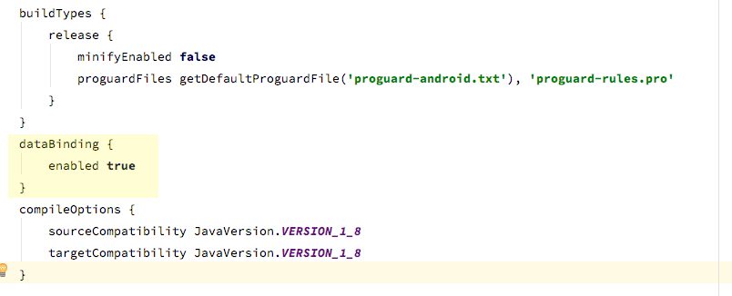
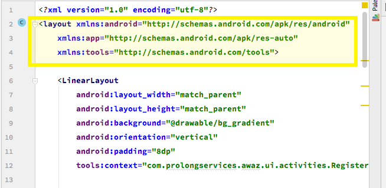
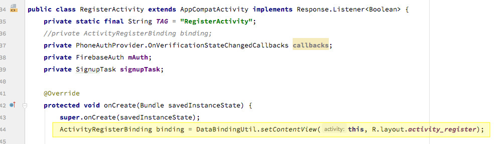

import Gist from 'react-gist'

## Avoid using findViewById in android, without third-party library
Hello guys,
As you all know to deal with views in android we have to find **xml** views in **java** code and then we can implement functionality on that view. But its very painful to find each and every view in java code. Its wastage of time. And sometimes due to wrong id we got **NullPointerException**. And after finding view we also have to **TypeCast** them to appropriate type of that view like **TextView**, **ImageView** etc. And if Types of views got mismatched then we got another exception which is **TypeCastException**.

There are many annotation processors available like **android annotations**, **butterknife** etc which help us to find and auto **TypeCast**. But we also have to configure them and have to bind each and every view. That annotation processing libraries will only help us with smart casting which means we don't need to **TypeCast**, views bind by these annotation processing libraries.

But they are not perfect solution.

So here is way to access **xml** views in **java** code without finding them and **TypeCast** them. The solution is Android's **DataBinding** library. This library is officially provided by android. And it also have many other features while working with **RecyclerView**. But in this post i will just discuss about accessing xml views in java without finding, binding or without any third-party library.

First enable DataBinding library from gradle. Now sync your project.

add this code in build.gradle file of your module.

    `dataBinding {
        enabled true
    }`


And you are ready to go.

Now open xml file of your Activity or Fragment, and wrap all code inside new tag `<layout>`.



<Gist id='a244190c8c8fa863d9b558ee999d9b84' />

And rebuild your project.

Now open java class of that **Activity** or **Fragment** and bind xml file as below.



## code for Activity :

<Gist id='01d986d6a028be8191b8892e61794b4f' />

## code for fragment :

### fragment_call_list.xml

<Gist id='08d62316e3ae4272337f1ed8ad90c63b' />

### CallListFragment.java

<Gist id='e75f1542d50e773789756dc3c7315eb7' />

For example if you want to enable this in Activity, and name of xml file of your Activity is **activity_main.xml** then DataBinding class of that Activity will generated with following name **ActivityMainBinding**.
This is pre qualified class built for xml file, and its name depend on xml file name.
So in Activity instead of
```java
setContentView()
```
write

```java
ActivityMainBinding binding = DataBindingUtil.setContentView(this, R.layout.activity_main);
```

now you can access xml view inside java code using that binding object as shown below.