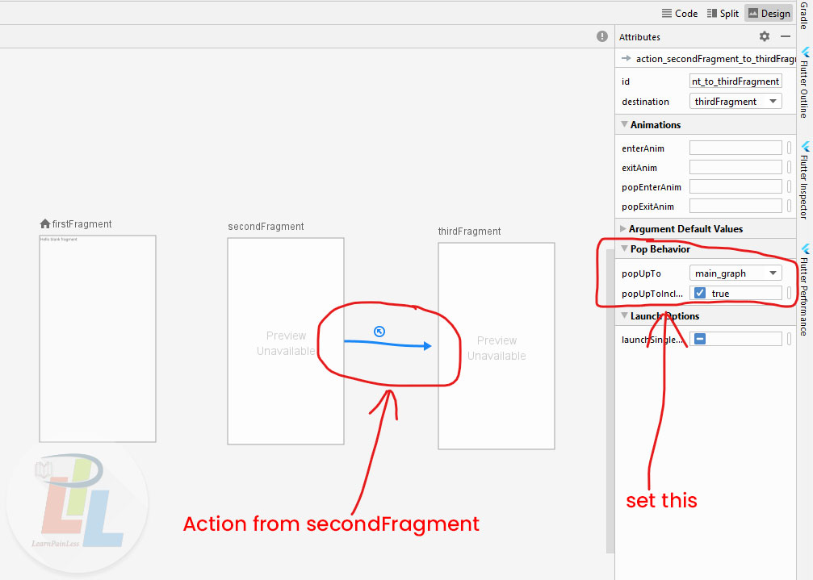

import Gist from 'react-gist'

clear navigation stack after navigating to another fragment
-----------------------------------------------------------

In this tutorial we will discuss about **Android Navigation library** which is part of **Jetpack**. This library help us in managing **navigation** in our android app by creating single Activity, **Navigation graph** etc. But as you start using **Android Navigation** you may face few problems. So we will discuss about one problem in this post.

So if we want to navigate to another fragment and we want to clear stack (remove all fragments which were opened previously) then we can tweak this by simply navigating to root of **Navigation** with the help of **Navigation graph** and then navigate to our destination fragment. Fortunately we don't need to this all stuff manually. We can do it easily with following method.

In your **Navigation Graph** add new _Action_ from **Fragment1** to **Fragment2** and inside that action add following properties **popUpTp="Navigation\_Graph\_Id"** and **popUpToInclusive="true"** and rebuild your project. After rebuilding project navigate to that newly created direction and that's it.

### Here is complete Example:

Code of **res/navigation/main\_graph.xml**

<Gist id='86b8545757fb08f089e24ef0cab0bcfb' />

After pasting above code in Navigation Graph, rebuild your project. Now do the following in current fragment

<Gist id='987147ad5793f1c715d6eeedbfd65dec' />

Now you will redirect from **SecondFragment** to **ThirdFragment** and **FirstFragment** and **SecondFragment** will be cleared from stack.
