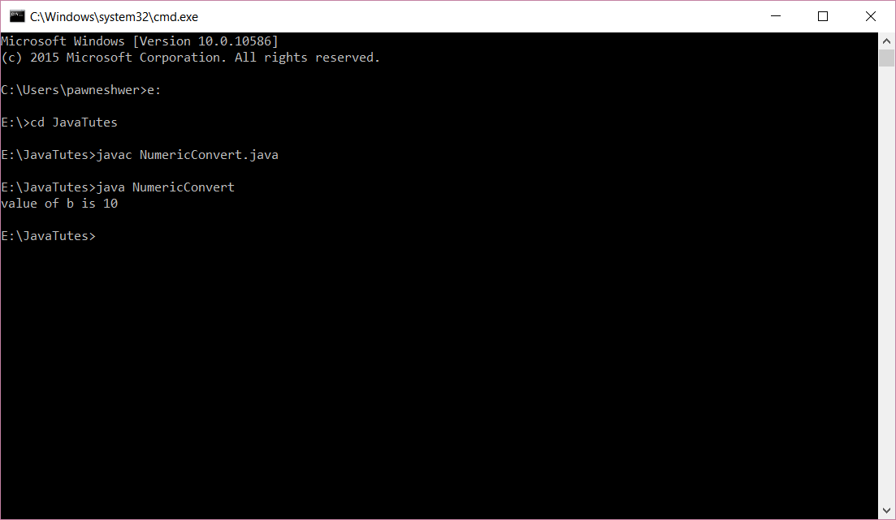
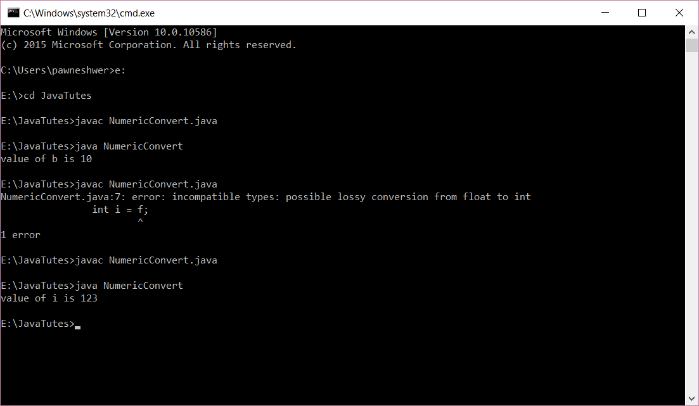

This is also called as Type Casting. There are two type of conversion available in java.

1.  Implicit
2.  Explicit

## <span style="color: #ff6600;">Implicit conversion:</span>

Implicit conversion means if we want to convert small unit to large unit then it’s called Implicit conversion. In this type of conversion, we don't need to do anything, simply assign small unit to large unit and conversion is done.

For example, if we want to convert int value to long value then we will simply assign int Variable to our long Variable and conversion is done.

For example

```java
int a = 10;
long b = a;
```

There is no loss of data in implicit conversion. No loss of data means value will be same as before. But in explicit conversion loss their data.

Try by your self : Open notepad and type below code to test. and save this file as "**NumericConvert.java**".

```java
class NumericConvert{
	public static void main(String[] args){
		int a = 10;
		long b = a;

		System.out.println("value of b is "+b);
	}
}
```

after running you will get below output.

[](img/numeric-convertion-1.png)

## <span style="color: #ff6600;">Explicit type casting:</span>

Explicit type cast means when we want to convert from large unit to small unit then it is called as explicit type casting. In this type casting we need to use name of that unit in which we want to convert from assignment.

For example, if we want to convert float value to int value them we will write this.

```java
float f = 123.4f;
int i = (int)f;
```

In this type of type casting variable lose their data. Output of this given example will be i = 123; T

his means it lose 4f.

Ok lets try this example Open Notepad and type below code inside notepad

```java
class NumericConvert{
	public static void main(String[] args){
		int a = 10;
		long b = a;

		float f = 123.4f;
		int i = f;
		System.out.println("value of i is "+i);
	}
}
```

and when you compile this code then you will get compile time error that "**Incompatible types**"

and now modify your code to this

```java
class NumericConvert{
	public static void main(String[] args){
		int a = 10;
		long b = a;

		float f = 123.4f;
		int i = (int)f;
		System.out.println("value of i is "+i);
	}
}
```

[](img/numeric-convertion-2.png)

now you will get this output and you can see that we loss our data we get only 123 as output.

