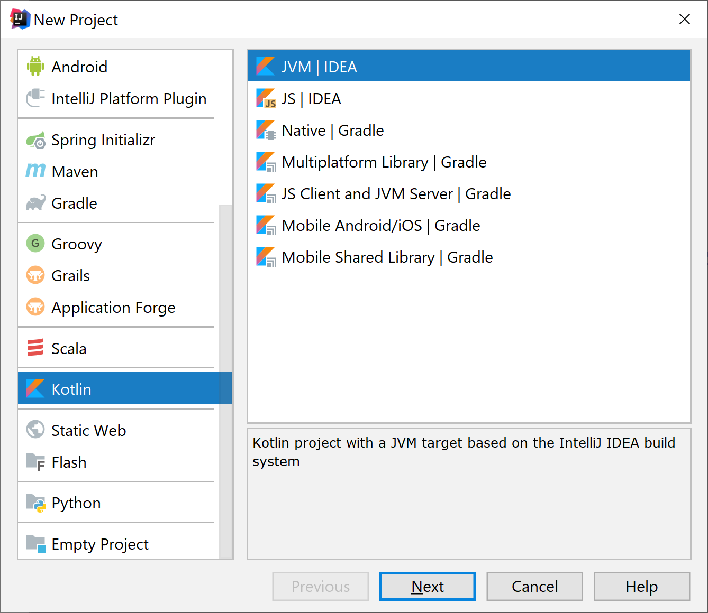
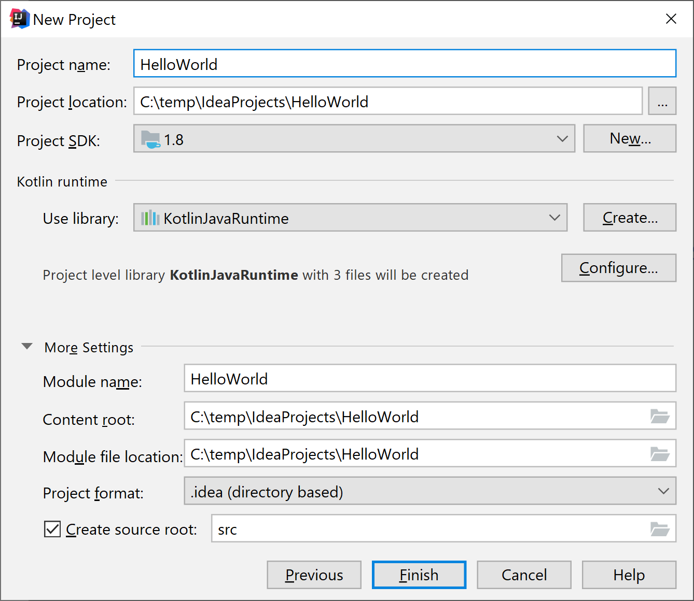
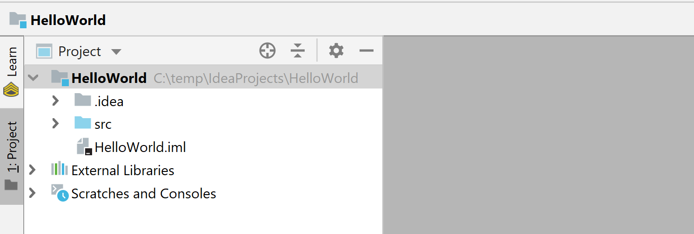
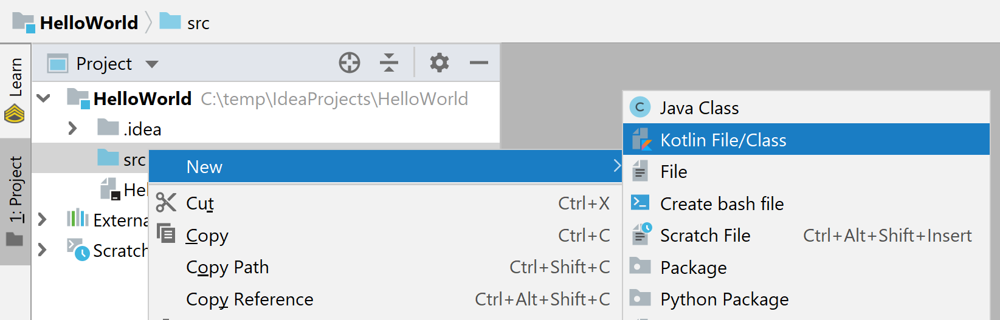
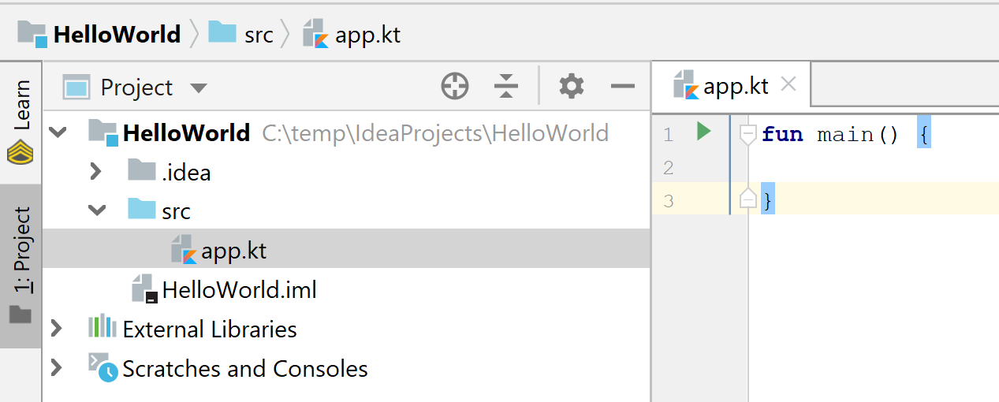
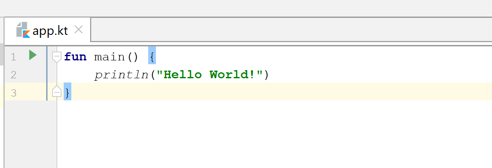
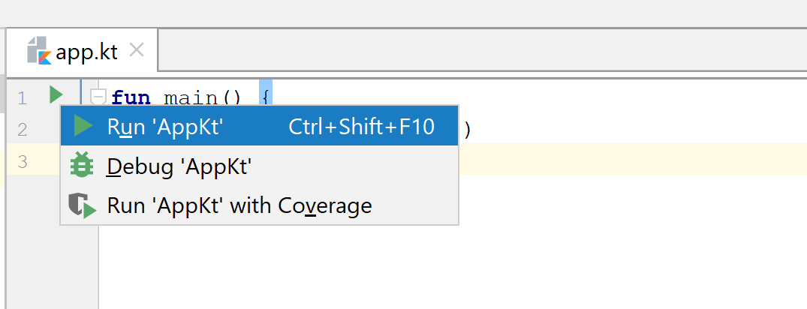
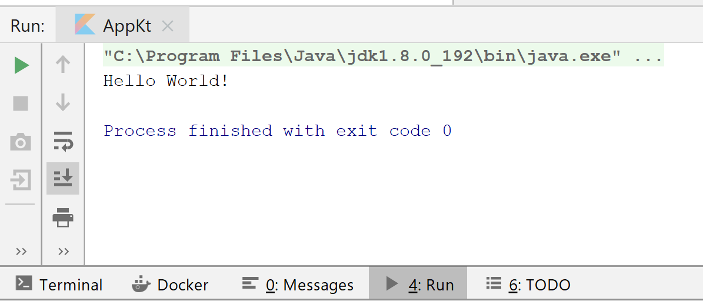

## Getting Started with IntelliJ IDEA for Kotlin

This tutorial walks you through creating an easy **Hello World** application
using **IntelliJ IDEA**.

Setting environment
-------------------

In this tutorial, we have to use **IntelliJ IDEA**. To get started, install the
most recent version of **IntelliJ IDEA**.

**Kotlin** is bundled with version 15 with the **IntelliJ IDEA**.

You can download the free community version (or the full-final version) from the
JetBrains website.

As an alternative to using IntelliJ IDEA, you will compile and execute
**Kotlin** applications using the instruction compiler. For details, see Working
with the instruction compiler.

If you are new to **JVM** and **Java**, observe the JVM Minimal Survival Guide.
If you are the new **IntelliJ IDEA**, then observe the **IntelliJ IDEA** Minimum
Survival Guide.

Create a replacement project
----------------------------

Once you have the **IntelliJ IDEA** installed, it is time to build your first
**Kotlin** application.

1.  Create a replacement project from a **File** -\> **New** -\> Select **Kotlin
    \| JVM \| IDEA** Project Type.
	

2.  Give your project a name and choose an SDK version for it.

Now you have a new project created with the following folder structure:

3.  Create a new Kotlin file under the source folder. It can be named anything.
    Let's call it the app.

4.  Once the file is created, add the main function that is the entry point of
    the Kotlin application. IntelliJ IDEA provides a template to do this
    quickly. Just type main and press tab.
	

5.  'Hello World!' Add a line of code to print.

Application running
-------------------

Now the application is ready to run. The easiest way is to click on the green
**run** icon in the gutter and choose the **run 'app.kt'**.

If all goes well, you will see the result in the tool window.

congratulation! Now you have your first **Kotlin** application running.

