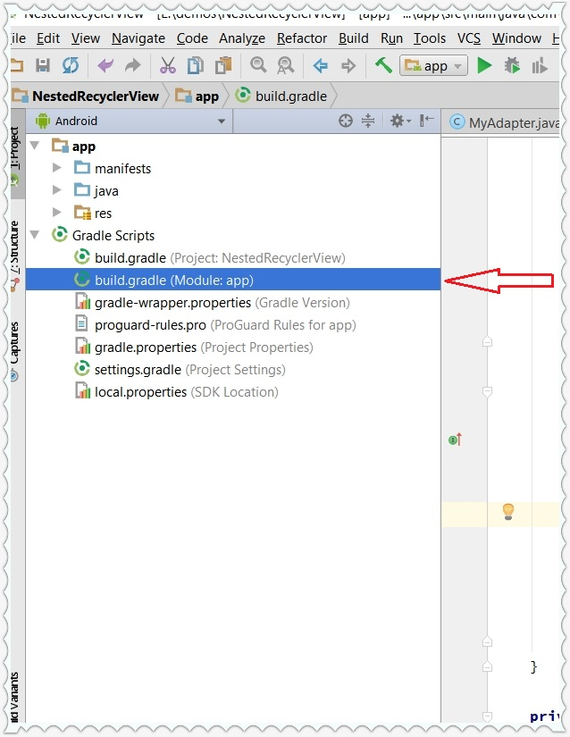
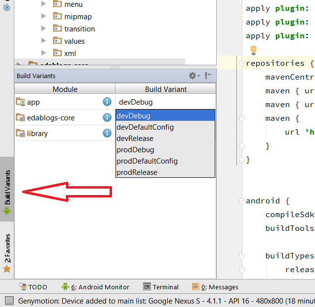

## How to speed up gradle build time if multidex enabled

Hello **Android Coders**, so we all use Android studio with **gradle** to build android projects. But after adding some dependency and enabling **multidex** support then **Android studio** will take up to 5 minutes to _build project_ every time. Which is too annoying to wait for long time to see new changes.

> We can also enable instant run feature of android studio but instant run decrease performance of Desktop/Laptop.

So the better way is to enable **multi flavor**. Which means build for multiple devices separately. Android studio build 1 apk for all devices/Android versions. So we can specify 1 device to target for development. (_Because we use 1-2 device to run and debug apps._) Then why we build apk for all android versions if we are testing on 1 android version. But don't worry **Release** apk will be for all android versions. And will be supported for all devices. And while building Release apk it will take normal time (4-5 minutes). But its OK because we will build Release apk only 1 time. And we can wait for 4-5 minutes to build release apk. This will decrease build time from 5-6 minutes to 20-30 seconds only. Which is great. So do the following changes in _build.gradle_ file of module (not in Project _build.gradle_ file)

[](img/New-Image.jpg)

1.  Open _build.gradle_ file of your project module. (by default its app). and do below changes

```java

android {
    compileSdkVersion 24
    buildToolsVersion "24.0.2"
        defaultConfig {
            applicationId "com.edablogs.showcase"
            targetSdkVersion 24
            minSdkVersion 16
            versionCode 1
            versionName "1.0"
            renderscriptTargetApi 22
            multiDexEnabled true
        }
    buildTypes {
        release {
            minifyEnabled false
            proguardFiles getDefaultProguardFile('proguard-android.txt'), 'proguard-rules.pro'
        }

    }
}
```

so add new node inside 'android' node named '**productFlavors**', this node is used to make project for multiple devices or multiple CPU's. and inside "**productFlavors**" node we need to create another node with any name. and inside those child nodes we will specify **minSdkVersion** only. and shift "**defaultConfig**" node inside "**buildTypes**" node. so your code will look like this

```java
android {
    compileSdkVersion 24
    buildToolsVersion "24.0.2"

    buildTypes {
        release {
            minifyEnabled false
            proguardFiles getDefaultProguardFile('proguard-android.txt'), 'proguard-rules.pro'
        }
        defaultConfig {
            applicationId "com.edablogs.showcase"
            targetSdkVersion 24
            versionCode 1
            versionName "1.0"
            renderscriptTargetApi 22
            multiDexEnabled true
        }
    }
    productFlavors {
        // Define separate dev and prod product flavors.
        dev {
            // dev utilizes minSDKVersion = 21 to allow the Android gradle plugin
            // to pre-dex each module and produce an APK that can be tested on
            // Android Lollipop without time consuming dex merging processes.
            minSdkVersion 21
        }
        prod {
            // The actual minSdkVersion for the application.
            minSdkVersion 16
        }
    }
}
```

And now click on product variant option on left bottom corner, and choose **devDebug** in build flavor. (as shown in below screenshot.)

[](img/speed_up_gradle_build_android_studio_2.png)

Now run your app on lollipop or higher version of android. And you will see result that build time is decreased.

## How it works ?

Reason behind this trick is **MultiDex**. on Old version of Android (less than sdk version 21) we need to use **multidex** library to enable _multidex_. and this library increase build time. But after releasing SDK 21 android had added **multidex** feature by default. we just need to write "multiDexEnabled true" in _build.gradle_ and everything is done. That's why we have made two variants of our project 1 have min sdk version 21 and other have actual min sdk version of your app. and we will select default build from "**buildVariants**" so Android Studio will build our project as SDK 21 and Android Studio will not compile "_**MultiDex library**_" which will take only 20-30 seconds to build a project. And when you build your app for Release then original build will be done which will take 5-6 minutes.
