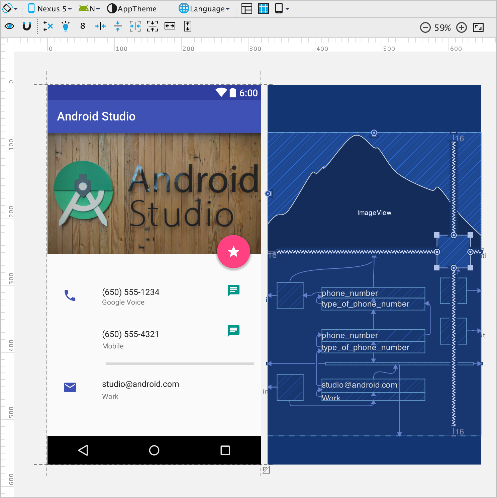

## Introducing new ConstraintLayout Android Studio
[](img/Layout_editor_image.png)

[Android](http://code.google.com/android/ "Android") introduced new Constraint Layout which is better than other view in Design View. This design is closely related to [iOS](http://www.apple.com/ios/ "IOS")'s Constraint Layout. Constraint Layout provide better support for [Drag and Drop](http://en.wikipedia.org/wiki/Drag_and_drop "Drag and drop") views. Drag and drop feature is already available in Relative Layout, but Relative Layout doesn't provide better responsive view. So this problem will be fixed in Constraint Layout which will provide accurate and [responsive design](http://en.wikipedia.org/wiki/Responsive_web_design "Responsive web design"). And Constraint Layout will support android 2.3 and above version of android.

You will able to us3 this new Constraint Layout in Android Studio 2.2 preview and higher version of android Studio. If you are still using old version of android Studio, then it is recommended to download Android Studio 2.2 preview version. You can't update from old version to android Studio 2.2 preview version. You need to download full package du3 to some [bug fix](http://en.wikipedia.org/wiki/Patch_%28computing%29 "Patch (computing)") and platform changes. And you also need to update android support library.

In [Android SDK](http://developer.android.com/sdk/index.html "Android SDK") there is also a Constraint Layout package available so download that package to make your [IDE](http://en.wikipedia.org/wiki/Integrated_development_environment "Integrated development environment") fully supported with this new Constraint Layout feature of android.

But Constraint Layout is in [alpha version](http://en.wikipedia.org/wiki/Software_release_life_cycle "Software release life cycle") so there will be some issues or bugs. And google doesn’t provide documentation for this new Constraint Layout they said that they are still doing some tests on this Constraint Layout and when this Layout will become stable then google will provide official documentation.
You need to Add the Constraint Layout library as a dependency in your build.gradle file:

```java
dependencies {
    compile 'com.android.support.constraint:constraint-layout:1.0.0-alpha3'
}
```

## <span style="color: #ff6600;">Features of Constraint Layout:</span>

1.  Full drag and drop support (better than Relative Layout's drag n drop feature.
2.  Drag anchor point from 1 view to other to connect them.
3.  Easy to resize view.
4.  the layout of each view is defined by associations to other elements in the layout, you can create a complex layout with a flat view hierarchy.

[](img/layouteditor-baseline.gif)

image-source: tools.android.com

## The different types of constraints you can define are as follows:

1.  **Side connection with the layout:** Connect the side of a view to the corresponding side of the layout. For example, connect the top side of a view to the top edge of the Constraint Layout.
2.  **Side connection with a view:** Connect the side of a view to the opposite side of another view. For example, connect the top side of a view A to the bottom side of view B so that A is always below B.
3.  **Side alignment with a view:** Align the edge of a view to the same edge of another view. For example, align the left side of view A to the left side of view B such that they are vertically stacked and left-aligned.
4.  **Baseline alignment with a view:** Align the text baseline of a view to the text baseline of another view. Use this to align views horizontally when it's more important that the text within the views align than it is that the view edges align.
