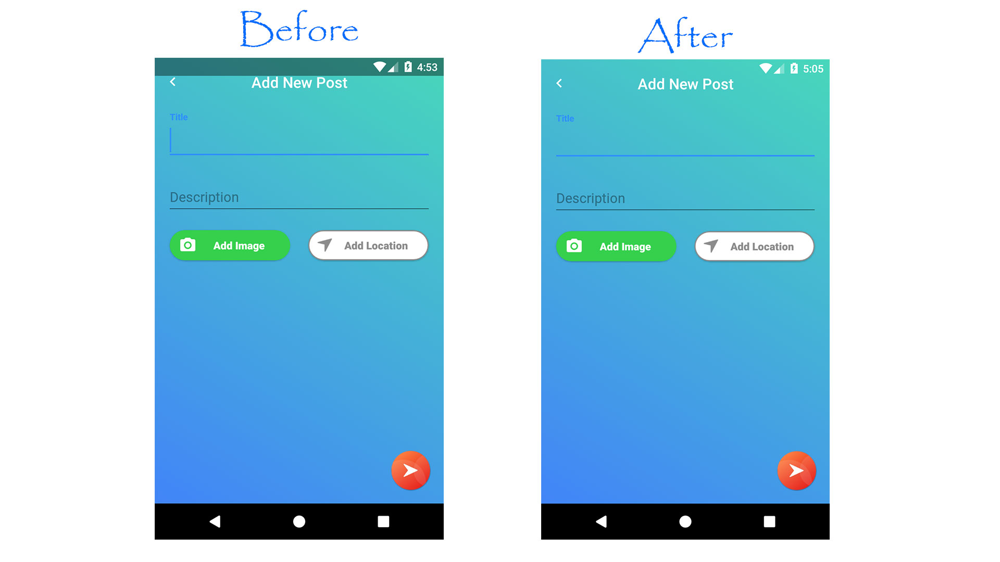
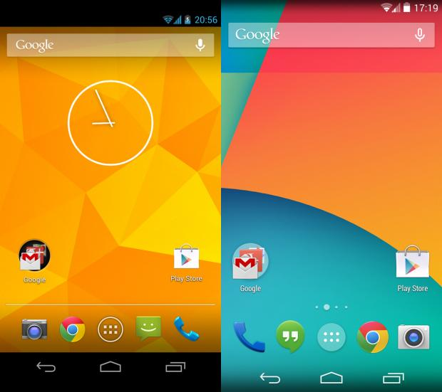

## how to make fully Android Transparent Status bar
Hello readers, You are here because you are interested in making your Android app's _status bar_ **fully transparent** as title of this post says **android transparent status bar**. You can do this from styles.xml or you can do this in JAVA code within an activity.


## Why making android transparent status bar from java?
We are doing this from java to avoid multiple changes in style.xml, color.xml etc. By this piece of code we will do everything in 1 place. If you have already tried doing changes in style.xml and got half transparent status bar then your problem will be solved by this method, because it will clear window flag and set new window flag to do its work.

This method will work on Android version above 21, means this will work on devices having Android lollipop and above. On android version 19 and 20 (Android kitkat) fully transparent status bar will not work but we will make status bar **Translucent** instead. Below is screenshot from 3 devices having android version Jelly Bean, Kitkat and Android N to show you difference.




### So lets start :
Open class file of your activity, in my case I'm going to open _LoginActivity.java_ file, and inside _onCreate()_ method paste below code and run your app on Android version 21 or higher to see the changes.

below is java code, but if you are working on kotlin then scroll down to get kotlin code as well.

```java
@Override
protected void onCreate(Bundle savedInstanceState) {
	...

	//make translucent statusBar on kitkat devices
	if (Build.VERSION.SDK_INT >= 19 && Build.VERSION.SDK_INT < 21) {
		setWindowFlag(this, WindowManager.LayoutParams.FLAG_TRANSLUCENT_STATUS, true);
	}
	if (Build.VERSION.SDK_INT >= 19) {
		getWindow().getDecorView().setSystemUiVisibility(View.SYSTEM_UI_FLAG_LAYOUT_STABLE | View.SYSTEM_UI_FLAG_LAYOUT_FULLSCREEN);
	}
	//make fully Android Transparent Status bar
	if (Build.VERSION.SDK_INT >= 21) {
		setWindowFlag(this, WindowManager.LayoutParams.FLAG_TRANSLUCENT_STATUS, false);
		getWindow().setStatusBarColor(Color.TRANSPARENT);
	}
}

public static void setWindowFlag(Activity activity, final int bits, boolean on) {
	Window win = activity.getWindow();
	WindowManager.LayoutParams winParams = win.getAttributes();
	if (on) {
		winParams.flags |= bits;
	} else {
		winParams.flags &= ~bits;
	}
	win.setAttributes(winParams);
}

```

### for kotlin developers

```kotlin
override fun onCreate(savedInstanceState: Bundle?) {
	super.onCreate(savedInstanceState)
	if (Build.VERSION.SDK_INT >= 19 && Build.VERSION.SDK_INT < 21) {
		setWindowFlag(WindowManager.LayoutParams.FLAG_TRANSLUCENT_STATUS, true)
	}
	if (Build.VERSION.SDK_INT >= 19) {
		window.decorView.systemUiVisibility = View.SYSTEM_UI_FLAG_LAYOUT_STABLE or View.SYSTEM_UI_FLAG_LAYOUT_FULLSCREEN
	}
	if (Build.VERSION.SDK_INT >= 21) {
		setWindowFlag(WindowManager.LayoutParams.FLAG_TRANSLUCENT_STATUS, false)
		window.statusBarColor = Color.TRANSPARENT
	}
	setupGoogleApiClient()
	AWSMobileClient.getInstance().initialize(this).execute()
}

private fun setWindowFlag(bits: Int, on: Boolean) {
	val win = window
	val winParams = win.attributes
	if (on) {
		winParams.flags = winParams.flags or bits
	} else {
		winParams.flags = winParams.flags and bits.inv()
	}
	win.attributes = winParams
}
```

### So here is how this method work :
First we will check android version is greater than 19 and less than 21 then we will set translusant status bar. and if android version is greater than 21 then we will set **"android transparent status bar"**. That's it now you gave to do this in all your activites, or you can create a BaseActivity having code of **"android transparent status bar"** and extend all your activity with BaseActivity and you are done.
