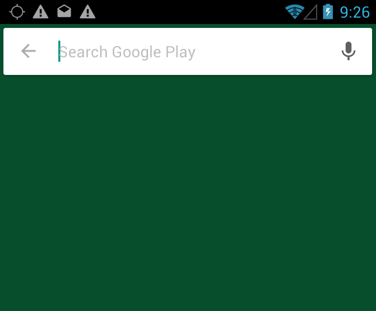
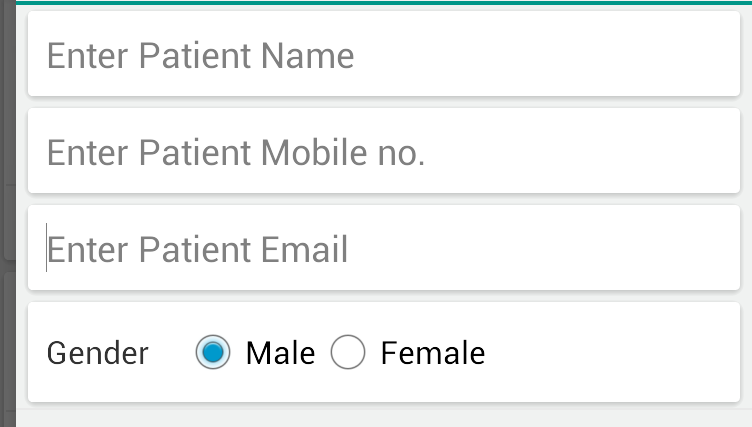

## Material design Edit text (Carded) in Android

If you want to create Edit Text same as search bar in Google map and in google playstore. As shown in below screenshot.



Then you can easily create without any third-party library.
They are actually cards (search bar cards). So we will also use CardView.
You simply need to put your EditText inside CardView and you are done.


But if you do so, then you will see underline below EditText which will not look like google map's search card. So the trick is set background of EditText to any color and your problem is solved.

### Here is complete example code :

```xml
<android.support.v7.widget.CardView
    android:layout_width="match_parent"
    android:layout_height="wrap_content"
    android:layout_marginTop="24dp">

    <EditText
        android:id="@+id/search"
        android:layout_width="match_parent"
        android:layout_height="wrap_content"
        android:background="@color/white"
        android:hint="Search ..."
        android:textSize="14sp"
        android:padding="8dp" />
</android.support.v7.widget.CardView>
```

As you can see i set background of EditText to white color and passing 8d. And my EditText looks exactly like google map's search card



Note: if you set background of EditText to"@null" then your EditText will look exactly like google map's search card but problem is that this will hide "pointer cursor", which blink inside EditText. And you have to create custom drawable for cursor pointer.
So better is to use background to same color as CardView.
