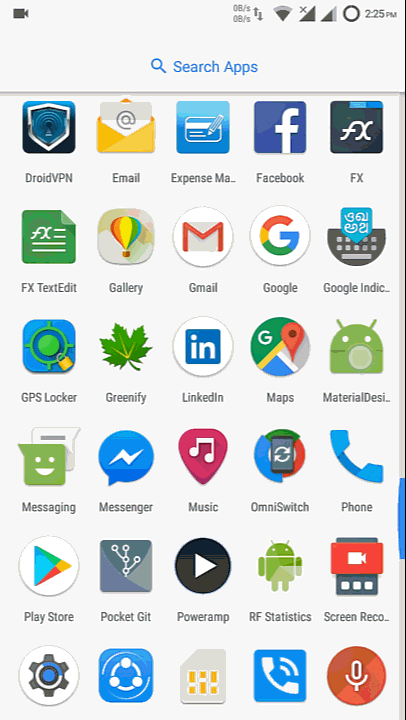

import Gist from 'react-gist'

## Open Close effect Android floating action button animation

In first lesson i will teach you that how you can rotate floating action button, to make effect like open and close floating action button with google material design. As shown in below screenshot.



Now you are thinking about that you can use 2 icons 1 for + icon and other for x icon. And then rotate + icon and hide it to show x icon.

<span style="color: #339966;">But not, actually its too easy.</span>

I will just rotate floating action button instead of + icon. And it will become open floating action button as google material design.

create new file in res/anim/ folder rotate_forward.xml and write below code :

#### rotate_forward.xml

```xml
<?xml version="1.0" encoding="utf-8"?>
<set xmlns:android="http://schemas.android.com/apk/res/android" android:fillAfter="true">
    <rotate
        android:fromDegrees="0"
        android:pivotX="50%"
        android:pivotY="50%"
        android:duration="300"
        android:interpolator="@android:anim/linear_interpolator"
        android:toDegrees="45" />
</set>
```

create new file in res/anim/ folder rotate_backward.xml and write below code :

#### rotate_backward.xml

```xml
<?xml version="1.0" encoding="utf-8"?>
<set xmlns:android="http://schemas.android.com/apk/res/android" android:fillAfter="true">
    <rotate
        android:fromDegrees="45"
        android:pivotX="50%"
        android:pivotY="50%"
        android:duration="300"
        android:interpolator="@android:anim/linear_interpolator"
        android:toDegrees="0" />
</set>
```

### Explanation:

code of rotate_forward.xml file rotate object from 0 degree to 45 degree, which will make + icon as x icon. "pivotX" and "pivotY" are center of object from where we want to rotate, duration is time period for animation, and fillAfter is to save state of animation.

to use these files lets code in java file.

#### MainActivity.java

<Gist id='7bd31972d892f51d6bf78f87c8a97728' />

and in layout file

#### activity_main.xml

<Gist id='414da57137d04c410d242ad7c4e80dcb' />

In further posts i will post more related to android floating action button animation
