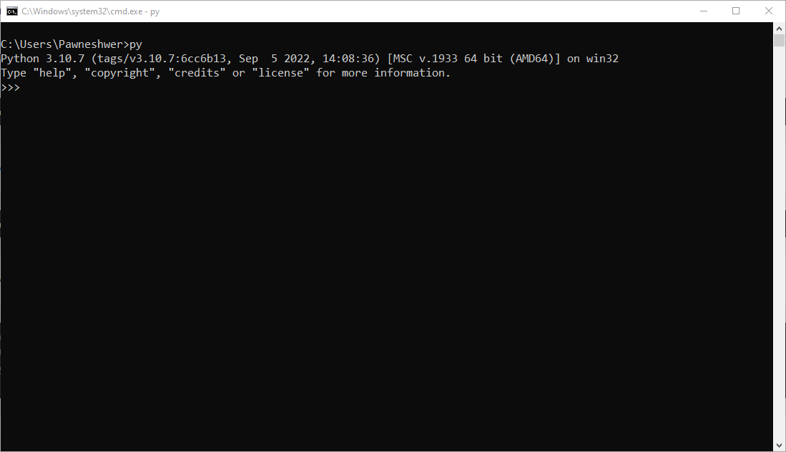
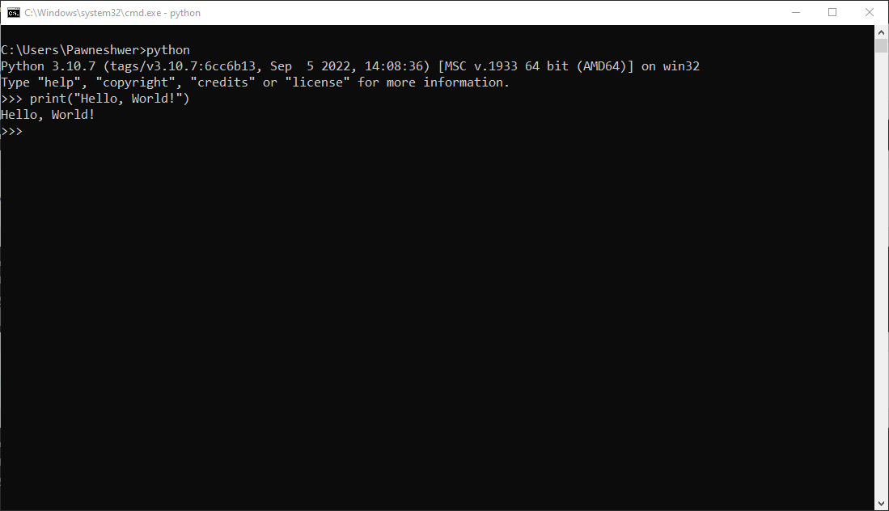
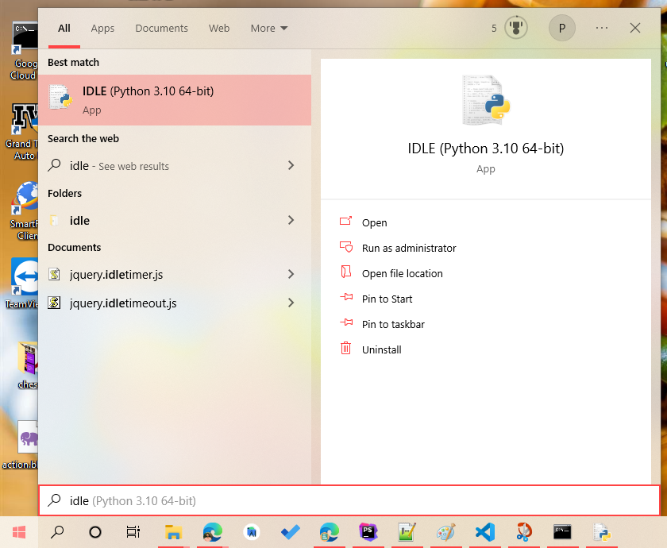
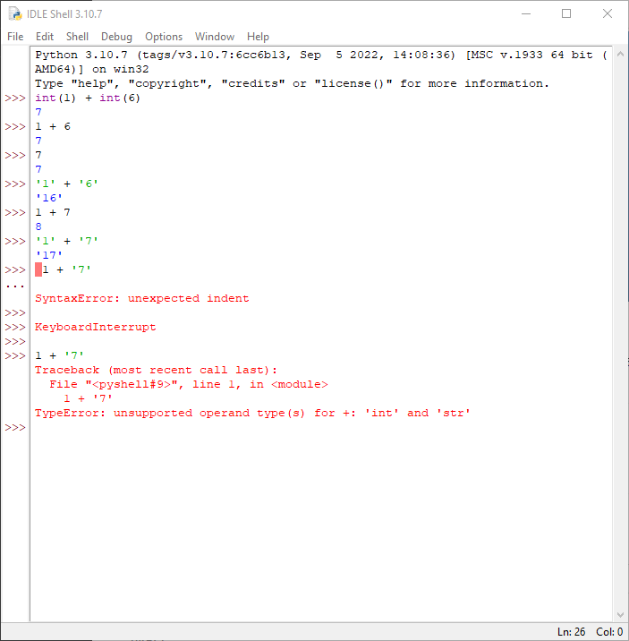
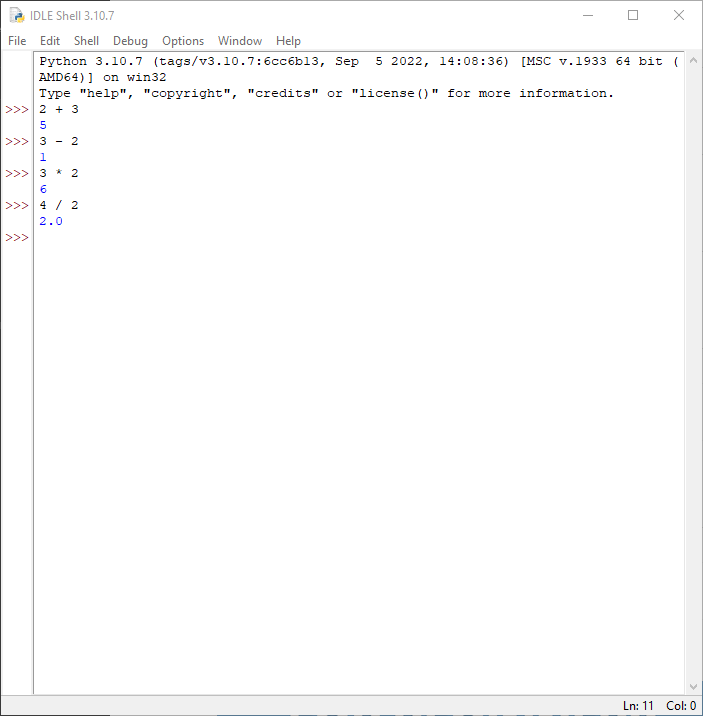

So this is brief introduction to syntax of Python language and use of operators as well.

### Syntax

Python is an interpreter-based programming language, it means that, as a developer you create Python (.py) file with an editor for text and insert those files into the Python interpreter so that they can be run.

The method to run a python script is similar to this command line:

> C:\\Users\\_Your Name_>python helloworld.py

In which case "**helloworld.py**" is the name of the Python file.

Let's write our very first Python file, which is called helloworld.py This is possible to do using every text editor.

```python
print("Hello, World!")
```

It's as easy and easy. You can save your files. Start the command prompt, go to the directory in which you saved your file and then run:

> C:\\Users\\_Your Name_>python helloworld.py

Congratulations! You've created and implemented your first Python program.

And the output will be:

> Hello, World!

### The Python Command Line

To test a small amount of Python code Sometimes it's the fastest and most efficient to not write the code into an unstructured file. This is because Python is able to be run in a command-line mode.

In your **Windows**, **Mac** or **Linux** command line:

> C:\\Users\\_Your Name_>python


If you find that the "**python**" command did not perform, attempt "**py**":



From there , you can create any Python program that you want, including the hello world example we showed earlier on in our tutorial



Once you're finished with the command line interface for Python it is easy to press the following key to quit the command line interface for Python:

> exit()

Or we can use Python's IDLE to write programs.





### Basic Usage:

#### Arithmetic operators:

we can use + (Add), - (Subtract), * (Multiply), / (Divide) operators



As you can see in above screenshot, we can easily perform Arithmetic operations in Python. But if you notice that if we divide **4 / 2** then its returning 2.0 (which is a float value) instead of 2. Because the reason behind this is that division operations can return decimal values. for example 

```python
3 / 2 = 1.5
```

but if you want output of divide in integer format (without decimal) then we can do 

```python
3 // 2 = 1
```

There are few special operators as well, for example 

```python
2 ** 3 = 8 //(3 is power of 2)
```