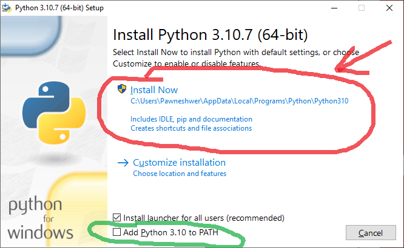
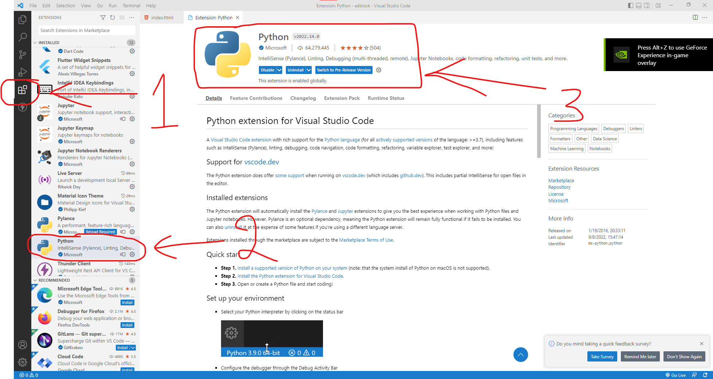

Download the latest version of Python from the official website [here](https://www.python.org/downloads/ "Download Python"). Currently latest version of Python is 3.10.7. This may be different when you install on your system.

Here i'll show process of installing Python on Windows 10 64bit PC.

After downloading Python setup, follow the on screen instructions.

Select the "**Add Python to PATH**" option and click on Install Now button. And Python will be installed on your system. And Python will be added to the system **PATH** so that Python will be accessible from anywhere in the **command prompt**.

### Setup VS Code for Python

Download and install VS Code from [this link](https://code.visualstudio.com/download "Download VS Code"). And install it as normal software.

After installing VS Code, we need to install a Python extension to support the Python language in VS Code.

After installing the Python extension in VS Code you can start working on Python.