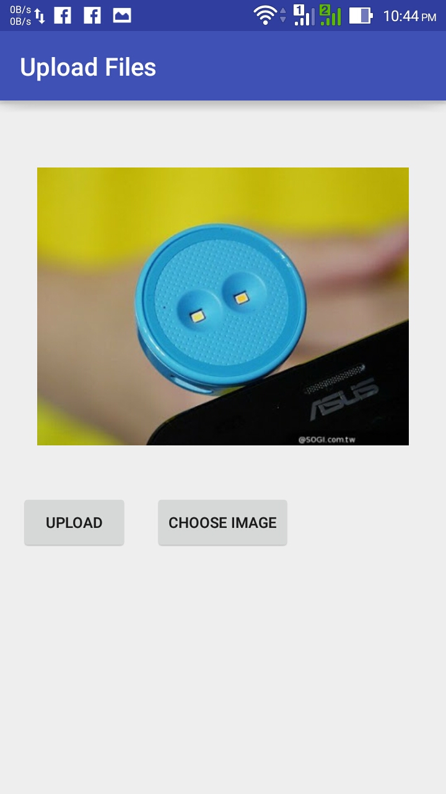

## Send multiple files to server using retrofit2
If you want to send multiple [files](http://en.wikipedia.org/wiki/Computer_file "Computer file"),Images, Text etc then you need to send that whole data as MultipartTypedOutput. This is same as Multipart Entity in [HTTP](http://en.wikipedia.org/wiki/Hypertext_Transfer_Protocol "Hypertext Transfer Protocol") Client & Post.

## [If you are using Retrofit then follow this guide.](/android/retrofit/send-multiple-files-to-server-using-retrofit-1-9)

## So lets start :

this is my [server](http://en.wikipedia.org/wiki/Server_%28computing%29 "Server (computing)") url where i m going to [upload](http://en.wikipedia.org/wiki/Uploading_and_downloading "Uploading and downloading") files :

```xml
http://192.168.1.105/learnpainless/android/file_upload/fileUpload.php
and these are parameters :  image,email,website
```

To send files to server we need to use **POST** method instead of **GET** method. I assume that you must know about **POST** and **GET** methods and you also know about how to use Retrofit2 [API](http://en.wikipedia.org/wiki/Application_programming_interface "Application programming interface"). and then we will attach "**MultipartTypedOutput**" to Body of our response to send over **POST** method.

*   First steps is to know what server will respond back when you submit data. and then make Getter Setter of that response. In this example my server will give following response as [JSON](http://en.wikipedia.org/wiki/JSON "JSON") [Feed :](http://en.wikipedia.org/wiki/Feed_URI_scheme "Feed URI scheme")

```json
{
  "file_name":"defiance-wallpaper-1920x1080.jpg",
  "email":"test@gmail.com",
  "website":"www.learnpainless.com",
  "message":"File uploaded successfully!",
  "error":false,
  "file_path":"http://192.168.1.105/android/file_upload/uploads/defiance-wallpaper-1920x1080.jpg"
}
```

*   So i will make Getter Setter file according to that response.

*   So open Android Studio and create new Project , if you want to embed in old project then skip this step.
*   Now open Build.gradle file of app directory as shown in below screenshot.
*   and add Retrofit2's compile dependency as shown below :

[](img/build-gradle-add.png)

[](img/build-gradle.png)

<pre style="color: #000000;">compile <span style="font-weight: bold; color: #008000;">'com.squareup.retrofit2:retrofit:2.1.0'</span>
compile <span style="font-weight: bold; color: #008000;">'com.squareup.retrofit2:converter-gson:2.1.0'</span>
</pre>


*   and click on sync project, and wait till android studio download all required files.
*   When build finish goto app/java/YOUR_PACKAGE_NAME/ (in this example my package name is **com.learnpainless.uploadfiles** ).
*   And create new class for getter-setters, i will name that file as "**ResponsePojo.class**".
*   and make getter-setters according to [Server](http://en.wikipedia.org/wiki/Web_server "Web server") response. my getter setter will look like below :
*   Ok so now create new Java Class name it as "**SubmitAPI**" and Kind will be **Interface**. as shown in below screenshot.

[](img/interface.png)

*   and write below code

```java
public interface SubmitAPI {
    @Multipart
    @POST("file_upload/fileUpload.php")
    Call<ResponsePojo> submitData(@Part MultipartBody.Part image,
                                  @Part("email") String email,
                                  @Part("website") String website);
}
```

*   open **MainActivity.java** class and create String value for url of server.The URL should be end with '/' as per Retrofit2.

<pre style="color: #000000;">String <span style="font-weight: bold; color: #660e7a;">ROOT_URL</span> = <span style="font-weight: bold; color: #008000;">"http://192.168.1.105/learnpainless/android/";</span></pre>

*   this is content of my **activity_main.xml** file

```xml
<?xml version="1.0" encoding="utf-8"?>
<RelativeLayout xmlns:android="http://schemas.android.com/apk/res/android"
    xmlns:tools="http://schemas.android.com/tools"
    android:layout_width="match_parent"
    android:layout_height="match_parent"
    android:paddingBottom="@dimen/activity_vertical_margin"
    android:paddingLeft="@dimen/activity_horizontal_margin"
    android:paddingRight="@dimen/activity_horizontal_margin"
    android:paddingTop="@dimen/activity_vertical_margin"
    tools:context="com.learnpainless.uploadfiles.MainActivity">

    <ImageView
        android:layout_width="300dp"
        android:id="@+id/image"
        android:layout_centerHorizontal="true"
        android:layout_height="300dp" />
    <Button
        android:layout_width="wrap_content"
        android:id="@+id/btn_choose"
        android:layout_below="@id/image"
        android:layout_centerHorizontal="true"
        android:text="Choose Image"
        android:layout_height="wrap_content" />
    <Button
        android:layout_width="wrap_content"
        android:text="upload"
        android:id="@+id/btn_upload"
        android:layout_below="@id/image"
        android:layout_height="wrap_content" />
</RelativeLayout>
```

*   this is content of  <span style="color: #800080;">**MainActivity.java**</span>

```java
package com.learnpainless.uploadfiles;

import android.app.Activity;
import android.content.DialogInterface;
import android.content.Intent;
import android.database.Cursor;
import android.net.Uri;
import android.os.Bundle;
import android.provider.MediaStore;
import android.support.v7.app.AlertDialog;
import android.support.v7.app.AppCompatActivity;
import android.util.Log;
import android.view.View;
import android.widget.Button;
import android.widget.ImageView;

import java.io.File;

import okhttp3.MediaType;
import okhttp3.MultipartBody;
import okhttp3.RequestBody;
import retrofit2.Call;
import retrofit2.Callback;
import retrofit2.Response;
import retrofit2.Retrofit;
import retrofit2.converter.gson.GsonConverterFactory;

public class MainActivity extends AppCompatActivity {

    // main url of server
    String ROOT_URL = "http://192.168.1.105/learnpainless/android/"; //base url should be end with /

    // gallery request code.
    public static final int GALLEY_REQUEST_CODE = 10;

    // tag to print logs.
    private String TAG = MainActivity.class.getSimpleName();
    private ImageView image;
    private Button btnChoose,btnUpload;
    private Uri realUri;
    @Override
    protected void onCreate(Bundle savedInstanceState) {
        super.onCreate(savedInstanceState);
        setContentView(R.layout.activity_main);

        image = (ImageView) findViewById(R.id.image);
        btnChoose = (Button) findViewById(R.id.btn_choose);
        btnUpload = (Button) findViewById(R.id.btn_upload);

        btnChoose.setOnClickListener(new View.OnClickListener() {
            @Override
            public void onClick(View v) {
                // this will open gallery to choose image.
                Intent openGallery = new Intent(Intent.ACTION_PICK,MediaStore.Images.Media.EXTERNAL_CONTENT_URI);
                startActivityForResult(Intent.createChooser(openGallery, "Open Gallery"), GALLEY_REQUEST_CODE);
            }
        });
        btnUpload.setOnClickListener(new View.OnClickListener() {
            @Override
            public void onClick(View v) {
                // this will build full path of API url where we want to send data.
                //Converter factory is required in Retrofit2 there are many converters, i'm using GSON Converter.
                Retrofit builder = new Retrofit.Builder().baseUrl(ROOT_URL).addConverterFactory(GsonConverterFactory.create()).build();
                SubmitAPI api = builder.create(SubmitAPI.class);

                //create file which we want to send to server.
                File imageFIle = new File(String.valueOf(realUri));

                //request body is used to attach file.
                RequestBody requestBody = RequestBody.create(MediaType.parse("multipart/form-data"),imageFIle);

                //and request body and file name using multipart.
                MultipartBody.Part image = MultipartBody.Part.createFormData("image", imageFIle.getName(),requestBody); //"image" is parameter for photo in API.

                Call<ResponsePojo> call = api.submitData(image, "pawneshwergupta@gmail.com", "learnpainless.com"); //we will get our response in call variable.

                call.enqueue(new Callback<ResponsePojo>() {
                    @Override
                    public void onResponse(Call<ResponsePojo> call, Response<ResponsePojo> response) {
                        ResponsePojo body = response.body(); //get body from response.


                        AlertDialog.Builder alert = new AlertDialog.Builder(MainActivity.this);
                        alert.setMessage(body.getMessage()); //display response in Alert dialog.
                        alert.setPositiveButton("OK", new DialogInterface.OnClickListener() {
                            @Override
                            public void onClick(DialogInterface dialog, int which) {

                            }
                        });
                        alert.show();
                    }

                    @Override
                    public void onFailure(Call<ResponsePojo> call, Throwable t) {

                    }
                });


            }
        });

    }

    @Override
    protected void onActivityResult(int requestCode, int resultCode, Intent data) {
        super.onActivityResult(requestCode, resultCode, data);
        if (requestCode == GALLEY_REQUEST_CODE && resultCode == Activity.RESULT_OK) {
            image.setImageURI(data.getData()); // set image to image view
            try{
                // Get real path to make File
                realUri = Uri.parse(getRealPathFromURI(data.getData()));
                Log.d(TAG,"Image path :- "+realUri);
            }
            catch (Exception e){
                Log.e(TAG,e.getMessage());
            }


        }
    }
    public String getRealPathFromURI(Uri contentUri) {
        String res = null;
        String[] proj = { MediaStore.Images.Media.DATA };
        Cursor cursor = getContentResolver().query(contentUri, proj, null, null, null);
        assert cursor != null;
        if(cursor.moveToFirst()){;
            int column_index = cursor.getColumnIndexOrThrow(MediaStore.Images.Media.DATA);
            res = cursor.getString(column_index);
        }
        cursor.close();
        return res;
    }
}


```

*   content of <span style="color: #800080;">**ResponsePojo.class**</span> file

```java
package com.learnpainless.uploadfiles;

import com.google.gson.annotations.Expose;
import com.google.gson.annotations.SerializedName;

public class ResponsePojo {
    @SerializedName("file_name")
    @Expose
    private String fileName;
    @SerializedName("email")
    @Expose
    private String email;
    @SerializedName("website")
    @Expose
    private String website;
    @SerializedName("message")
    @Expose
    private String message;
    @SerializedName("error")
    @Expose
    private Boolean error;
    @SerializedName("file_path")
    @Expose
    private String filePath;

    public String getFileName() {
        return fileName;
    }

    public void setFileName(String fileName) {
        this.fileName = fileName;
    }

    public String getEmail() {
        return email;
    }

    public void setEmail(String email) {
        this.email = email;
    }

    public String getWebsite() {
        return website;
    }

    public void setWebsite(String website) {
        this.website = website;
    }

    public String getMessage() {
        return message;
    }

    public void setMessage(String message) {
        this.message = message;
    }

    public Boolean getError() {
        return error;
    }

    public void setError(Boolean error) {
        this.error = error;
    }

    public String getFilePath() {
        return filePath;
    }

    public void setFilePath(String filePath) {
        this.filePath = filePath;
    }

}

```

*   content of <span style="color: #800080;">**SubmitAPI.class**</span> file

```java
package com.learnpainless.uploadfiles;

import okhttp3.MultipartBody;
import retrofit2.Call;
import retrofit2.http.Multipart;
import retrofit2.http.POST;
import retrofit2.http.Part;

/**
 * Created by pawneshwer on 5/22/2016.
 */
public interface SubmitAPI {
    @Multipart
    @POST("file_upload/fileUpload.php")
    Call<ResponsePojo> submitData(@Part MultipartBody.Part image,
                                  @Part("email") String email,
                                  @Part("website") String website);
}

```

*   In <span style="color: #800080;">**AndroidManifest.xml**</span> file add these 3 permissions

```xml
<uses-permission android:name="android.permission.INTERNET" />
<uses-permission android:name="android.permission.READ_EXTERNAL_STORAGE" />
<uses-permission android:name="android.permission.WRITE_EXTERNAL_STORAGE" />
```

*   Now run your app in device and try to upload images.

[](img/Screenshot_2016-05-22-22-43-46.jpg)

[](img/Screenshot_2016-05-22-22-44-06.jpg)

[](img/Screenshot_2016-05-22-22-44-53.jpg)
