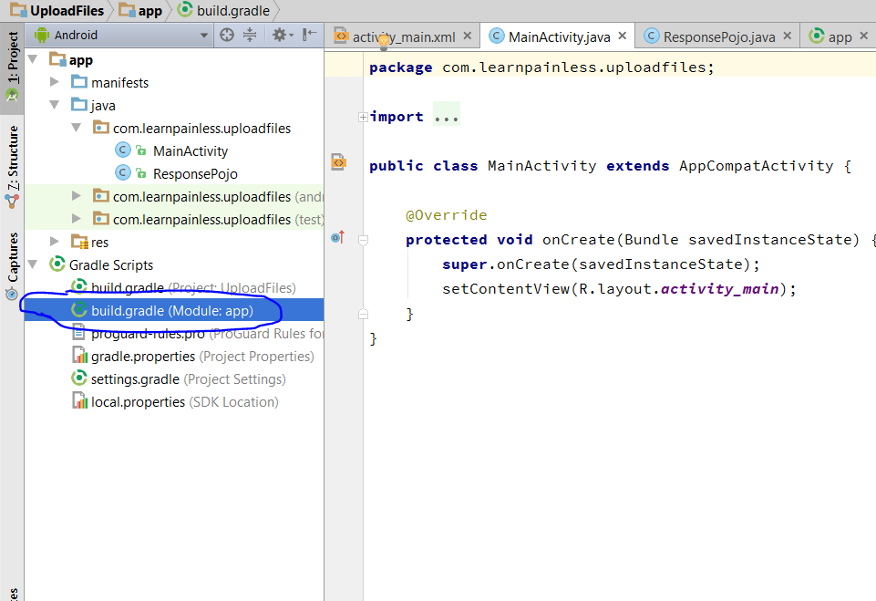
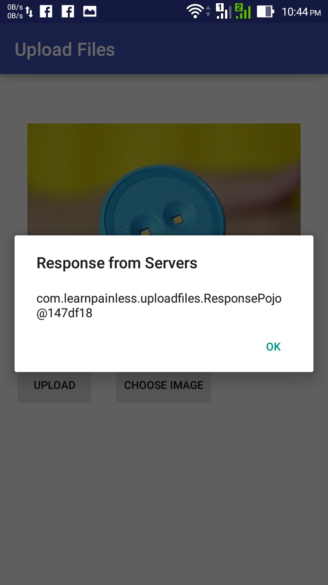

If you want to send multiple [files](http://en.wikipedia.org/wiki/Computer_file "Computer file"),Images, Text etc then you need to send that whole data as MultipartTypedOutput. This is same as Multipart Entity in [HTTP](http://en.wikipedia.org/wiki/Hypertext_Transfer_Protocol "Hypertext Transfer Protocol") Client & Post.

## [If you are using Retrofit2 then follow this guide.](/android/retrofit2/send-multiple-files-to-server-using-retrofi2 "upload files using Retrofit2")

## <span style="color: #ff6600;">So lets start :</span>

this is my [server](http://en.wikipedia.org/wiki/Server_%28computing%29 "Server (computing)") url where i m going to [upload](http://en.wikipedia.org/wiki/Uploading_and_downloading "Uploading and downloading") files :
```xml
http://192.168.1.106/learnpainless/android/file_upload/fileUpload.php
and these are parameters :  image,email,website
```

To send files to server we need to use **POST** method instead of **GET** method. I assume that you must know about **POST** and **GET** methods and you also know about how to use Retrofit [API](http://en.wikipedia.org/wiki/Application_programming_interface "Application programming interface"). and then we will attach "**MultipartTypedOutput**" to Body of our response to send over **POST** method.

*   First steps is to know what server will respond back when you submit data. and then make Getter Setter of that response. In this example my server will give following response as [JSON](http://en.wikipedia.org/wiki/JSON "JSON") [Feed :](http://en.wikipedia.org/wiki/Feed_URI_scheme "Feed URI scheme")

```json
{
  "file_name":"defiance-wallpaper-1920x1080.jpg",
  "email":"test@gmail.com",
  "website":"www.learnpainless.com",
  "message":"File uploaded successfully!",
  "error":false,
  "file_path":"http://192.168.1.106/android/file_upload/uploads/defiance-wallpaper-1920x1080.jpg"
}
```

*   So i will make Getter Setter file according to that response.

*   So open Android Studio and create new Project , if you want to embed in old project then skip this step.
*   Now open Build.gradle file of app directory as shown in below screenshot.
*   and add Retrofit's compile dependency as shown below :

[](img/build-gradle-add.png)

[](img/build-gradle.png)

<pre style="color: #000000;">compile <span style="font-weight: bold; color: #008000;">'com.squareup.retrofit:retrofit:1.9.0'</span></pre>

*   and click on sync project, and wait till android studio download all required files.
*   When build finish goto app/java/YOUR_PACKAGE_NAME/ (in this example my package name is <span style="color: #800080;">**com.learnpainless.uploadfiles**</span> ).
*   And create new class for getter-setters, i will name that file as "<span style="color: #800080;">**ResponsePojo.class**</span>".
*   and make getter-setters according to [Server](http://en.wikipedia.org/wiki/Web_server "Web server") response. my getter setter will look like below :
*   Ok so now create new Java Class name it as "<span style="color: #800080;">**SubmitAPI**</span>" and Kind will be <span style="color: #800080;">**Interface**</span>. as shown in below screenshot.

[](img/interface.png)

*   and write below code

```java
public interface SubmitAPI {
  @POST("/file_upload/fileUpload.php")
  void submitData(@Body MultipartTypedOutput attachments, Callback<ResponsePojo> response);
}
```

*   open <span style="color: #800080;">**MainActivity.java**</span> class and create String value for url of server.

<pre style="color: #000000;">String <span style="font-weight: bold; color: #660e7a;">ROOT_URL</span> = <span style="font-weight: bold; color: #008000;">"http://192.168.1.106/learnpainless/android"</span>;</pre>

*   this is content of my <span style="color: #800080;">**activity_main.xml**</span> file

```xml
<?xml version="1.0" encoding="utf-8"?>
<RelativeLayout xmlns:android="http://schemas.android.com/apk/res/android"
    xmlns:tools="http://schemas.android.com/tools"
    android:layout_width="match_parent"
    android:layout_height="match_parent"
    android:paddingBottom="@dimen/activity_vertical_margin"
    android:paddingLeft="@dimen/activity_horizontal_margin"
    android:paddingRight="@dimen/activity_horizontal_margin"
    android:paddingTop="@dimen/activity_vertical_margin"
    tools:context="com.learnpainless.uploadfiles.MainActivity">

    <ImageView
        android:layout_width="300dp"
        android:id="@+id/image"
        android:layout_centerHorizontal="true"
        android:layout_height="300dp" />
    <Button
        android:layout_width="wrap_content"
        android:id="@+id/btn_choose"
        android:layout_below="@id/image"
        android:layout_centerHorizontal="true"
        android:text="Choose Image"
        android:layout_height="wrap_content" />
    <Button
        android:layout_width="wrap_content"
        android:text="upload"
        android:id="@+id/btn_upload"
        android:layout_below="@id/image"
        android:layout_height="wrap_content" />
</RelativeLayout>
```

*   this is content of  <span style="color: #800080;">**MainActivity.java**</span>

```java
package com.learnpainless.uploadfiles;

import android.app.Activity;
import android.content.DialogInterface;
import android.content.Intent;
import android.database.Cursor;
import android.net.Uri;
import android.os.Bundle;
import android.provider.MediaStore;
import android.support.v7.app.AlertDialog;
import android.support.v7.app.AppCompatActivity;
import android.util.Log;
import android.view.View;
import android.widget.Button;
import android.widget.ImageView;

import java.io.File;

import retrofit.Callback;
import retrofit.RestAdapter;
import retrofit.RetrofitError;
import retrofit.client.Response;
import retrofit.mime.MultipartTypedOutput;
import retrofit.mime.TypedFile;
import retrofit.mime.TypedString;

public class MainActivity extends AppCompatActivity {

    // main url of server
    String ROOT_URL = "http://192.168.1.106/learnpainless/android";

    // gallery request code.
    public static final int GALLEY_REQUEST_CODE = 10;

    // tag to print logs.
    private String TAG = MainActivity.class.getSimpleName();
    private ImageView image;
    private Button btnChoose,btnUpload;
    private Uri realUri;
    @Override
    protected void onCreate(Bundle savedInstanceState) {
        super.onCreate(savedInstanceState);
        setContentView(R.layout.activity_main);

        image = (ImageView) findViewById(R.id.image);
        btnChoose = (Button) findViewById(R.id.btn_choose);
        btnUpload = (Button) findViewById(R.id.btn_upload);

        btnChoose.setOnClickListener(new View.OnClickListener() {
            @Override
            public void onClick(View v) {
                // this will open gallery to choose image.
                Intent openGallery = new Intent(Intent.ACTION_PICK,MediaStore.Images.Media.EXTERNAL_CONTENT_URI);
                startActivityForResult(Intent.createChooser(openGallery, "Open Gallery"), GALLEY_REQUEST_CODE);
            }
        });
        btnUpload.setOnClickListener(new View.OnClickListener() {
            @Override
            public void onClick(View v) {
                // this will build full path of API url where we want to send data.
                RestAdapter restAdapter = new RestAdapter.Builder().setEndpoint(ROOT_URL).build();

                // SubmitAPI is name of our interface which will send data to server.
                SubmitAPI api = restAdapter.create(SubmitAPI.class);
                api.submitData(attachFiles(), new Callback<ResponsePojo>() {
                    @Override
                    public void success(ResponsePojo responsePojo, Response response) {
                        // responsePojo is object of our getter setter class and getError is method i made to get server response.
                        if (responsePojo.getError() == false){
                            AlertDialog.Builder builder = new AlertDialog.Builder(MainActivity.this);
                            builder.setMessage(responsePojo.toString()).setTitle("Response from Servers")
                                    .setCancelable(false)
                                    .setPositiveButton("OK", new DialogInterface.OnClickListener() {
                                        public void onClick(DialogInterface dialog, int id) {
                                            // do nothing
                                        }
                                    });
                            AlertDialog alert = builder.create();
                            alert.show();
                        }
                        else {
                            Log.d(TAG,"Data not uploaded");
                        }
                    }

                    @Override
                    public void failure(RetrofitError error) {
                        Log.d(TAG,"unable to transfer data to server due to :"+ error.getMessage());
                    }
                });
            }
        });

    }

    private MultipartTypedOutput attachFiles(){
        MultipartTypedOutput multipartTypedOutput = new MultipartTypedOutput();

        // this will add data to body to send via retrofit.
        multipartTypedOutput.addPart("email",new TypedString("pawneshwergupta@gmail.com"));
        multipartTypedOutput.addPart("website", new TypedString("https://www.learnpainless.com"));

        // this will make Retrofit file from gallery image
        multipartTypedOutput.addPart("image", makeFile(realUri.toString()));
        return multipartTypedOutput;
    }

    private TypedFile makeFile(String uri){
        // this will make file which is required by Retrofit.
        File file = new File(uri);
        TypedFile typedFile = new TypedFile("image/*",file);
        return typedFile;
    }

    @Override
    protected void onActivityResult(int requestCode, int resultCode, Intent data) {
        super.onActivityResult(requestCode, resultCode, data);
        if (requestCode == GALLEY_REQUEST_CODE && resultCode == Activity.RESULT_OK) {
            image.setImageURI(data.getData()); // set image to image view
            try{
                // Get real path to make File
                realUri = Uri.parse(getPath(data.getData()));
                Log.d(TAG,"Image path :- "+realUri);
            }
            catch (Exception e){
                Log.e(TAG,e.getMessage());
            }


        }
    }
    private String getPath(Uri uri) throws Exception {
        // this method will be used to get real path of Image chosen from gallery.
        String[] projection = { MediaStore.Images.Media.DATA };
        Cursor cursor = managedQuery(uri, projection, null, null, null);
        int column_index = cursor.getColumnIndexOrThrow(MediaStore.Images.Media.DATA);
        cursor.moveToFirst();
        return cursor.getString(column_index);
    }
}

```

*   content of <span style="color: #800080;">**ResponsePojo.class**</span> file

```java
package com.learnpainless.uploadfiles;

import com.google.gson.annotations.Expose;
import com.google.gson.annotations.SerializedName;

public class ResponsePojo {
    @SerializedName("file_name")
    @Expose
    private String fileName;
    @SerializedName("email")
    @Expose
    private String email;
    @SerializedName("website")
    @Expose
    private String website;
    @SerializedName("message")
    @Expose
    private String message;
    @SerializedName("error")
    @Expose
    private Boolean error;
    @SerializedName("file_path")
    @Expose
    private String filePath;

    public String getFileName() {
        return fileName;
    }

    public void setFileName(String fileName) {
        this.fileName = fileName;
    }

    public String getEmail() {
        return email;
    }

    public void setEmail(String email) {
        this.email = email;
    }

    public String getWebsite() {
        return website;
    }

    public void setWebsite(String website) {
        this.website = website;
    }

    public String getMessage() {
        return message;
    }

    public void setMessage(String message) {
        this.message = message;
    }

    public Boolean getError() {
        return error;
    }

    public void setError(Boolean error) {
        this.error = error;
    }

    public String getFilePath() {
        return filePath;
    }

    public void setFilePath(String filePath) {
        this.filePath = filePath;
    }

}

```

*   content of <span style="color: #800080;">**SubmitAPI.class**</span> file

```java
package com.learnpainless.uploadfiles;

import retrofit.Callback;
import retrofit.http.Body;
import retrofit.http.POST;
import retrofit.mime.MultipartTypedOutput;

/**
 * Created by pawneshwer on 5/22/2016.
 */
public interface SubmitAPI {
    @POST("/file_upload/fileUpload.php")
    void submitData(@Body MultipartTypedOutput attachments, Callback<ResponsePojo> response);
}

```

*   In <span style="color: #800080;">**AndroidManifest.xml**</span> file add these 3 permissions

```xml
<uses-permission android:name="android.permission.INTERNET" />
<uses-permission android:name="android.permission.READ_EXTERNAL_STORAGE" />
<uses-permission android:name="android.permission.WRITE_EXTERNAL_STORAGE" />
```

*   Now run your app in device and try to upload images.

[](img/Screenshot_2016-05-22-22-43-46.jpg)

[](img/Screenshot_2016-05-22-22-44-06.jpg)

[](img/Screenshot_2016-05-22-22-44-53.jpg)
