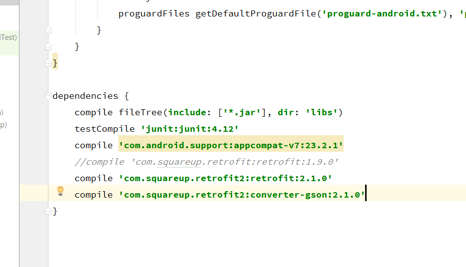
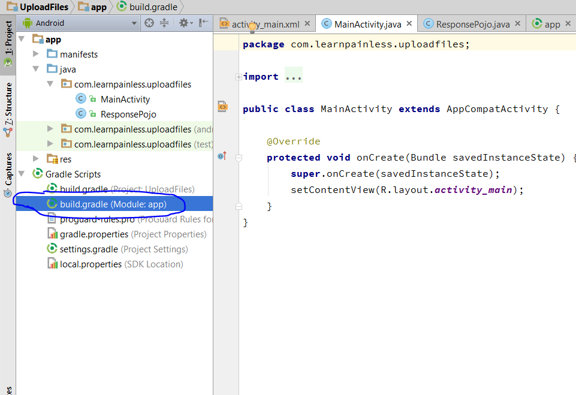
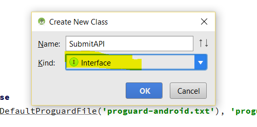
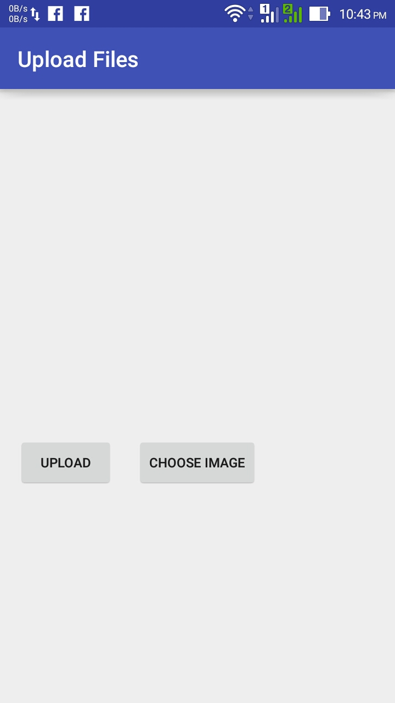
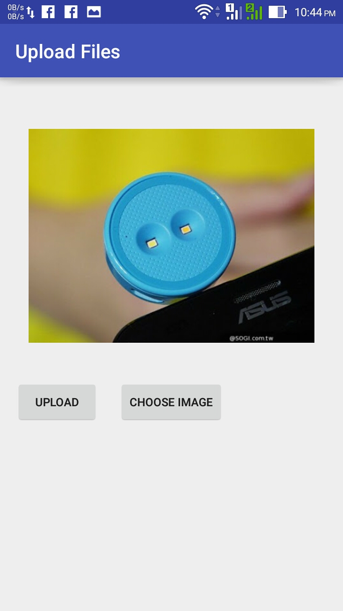
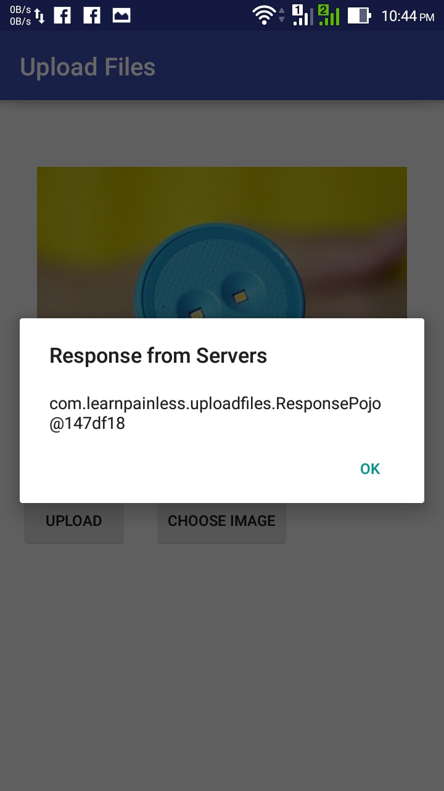

import Gist from 'react-gist'

If you want to send multiple [files](http://en.wikipedia.org/wiki/Computer_file "Computer file"),Images, Text etc then you need to send that whole data as MultipartTypedOutput. This is same as Multipart Entity in [HTTP](http://en.wikipedia.org/wiki/Hypertext_Transfer_Protocol "Hypertext Transfer Protocol") Client & Post.

## [If you are using Retrofit2 then follow this guide.](/android/retrofit2/send-multiple-files-to-server-using-retrofi2 "upload files using Retrofit2")

## <span style="color: #ff6600;">So lets start :</span>

this is my [server](http://en.wikipedia.org/wiki/Server_%28computing%29 "Server (computing)") url where i m going to [upload](http://en.wikipedia.org/wiki/Uploading_and_downloading "Uploading and downloading") files :
```xml
http://192.168.1.106/learnpainless/android/file_upload/fileUpload.php
and these are parameters :  image,email,website
```

To send files to server we need to use **POST** method instead of **GET** method. I assume that you must know about **POST** and **GET** methods and you also know about how to use Retrofit [API](http://en.wikipedia.org/wiki/Application_programming_interface "Application programming interface"). and then we will attach "**MultipartTypedOutput**" to Body of our response to send over **POST** method.

*   First steps is to know what server will respond back when you submit data. and then make Getter Setter of that response. In this example my server will give following response as [JSON](http://en.wikipedia.org/wiki/JSON "JSON") [Feed :](http://en.wikipedia.org/wiki/Feed_URI_scheme "Feed URI scheme")

<Gist id='9c3713a90419a1341dd04984379142b2' file='data.json' />

*   So i will make Getter Setter file according to that response.

*   So open Android Studio and create new Project , if you want to embed in old project then skip this step.
*   Now open Build.gradle file of app directory as shown in below screenshot.
*   and add Retrofit's compile dependency as shown below :

[](./img/build-gradle-add.png)

[](img/build-gradle.png)

```
compile 'com.squareup.retrofit:retrofit:1.9.0'
```
*   and click on sync project, and wait till android studio download all required files.
*   When build finish goto app/java/YOUR_PACKAGE_NAME/ (in this example my package name is <span style="color: #800080;">**com.learnpainless.uploadfiles**</span> ).
*   And create new class for getter-setters, i will name that file as "<span style="color: #800080;">**ResponsePojo.class**</span>".
*   and make getter-setters according to [Server](http://en.wikipedia.org/wiki/Web_server "Web server") response. my getter setter will look like below :
*   Ok so now create new Java Class name it as "<span style="color: #800080;">**SubmitAPI**</span>" and Kind will be <span style="color: #800080;">**Interface**</span>. as shown in below screenshot.

[](img/interface.png)

*   and write below code

```java
public interface SubmitAPI {
  @POST("/file_upload/fileUpload.php")
  void submitData(@Body MultipartTypedOutput attachments, Callback<ResponsePojo> response);
}
```

*   open <span style="color: #800080;">**MainActivity.java**</span> class and create String value for url of server.

```java
String ROOT_URL = "http://192.168.1.106/learnpainless/android";
```
*   this is content of my <span style="color: #800080;">**activity_main.xml**</span> file

<Gist id='9c3713a90419a1341dd04984379142b2' file='activity_main.xml' />

*   this is content of  <span style="color: #800080;">**MainActivity.java**</span>

<Gist id='9c3713a90419a1341dd04984379142b2' file='MainActivity.java' />

*   content of <span style="color: #800080;">**ResponsePojo.java**</span> file

<Gist id='9c3713a90419a1341dd04984379142b2' file='ResponsePojo.java' />

*   content of <span style="color: #800080;">**SubmitAPI.java**</span> file

<Gist id='9c3713a90419a1341dd04984379142b2' file='SubmitAPI.java' />

*   In <span style="color: #800080;">**AndroidManifest.xml**</span> file add these 3 permissions

<Gist id='9c3713a90419a1341dd04984379142b2' file='AndroidManifest.xml' />

*   Now run your app in device and try to upload images.

[](img/Screenshot_2016-05-22-22-43-46.jpg)

[](img/Screenshot_2016-05-22-22-44-06.jpg)

[](img/Screenshot_2016-05-22-22-44-53.jpg)
