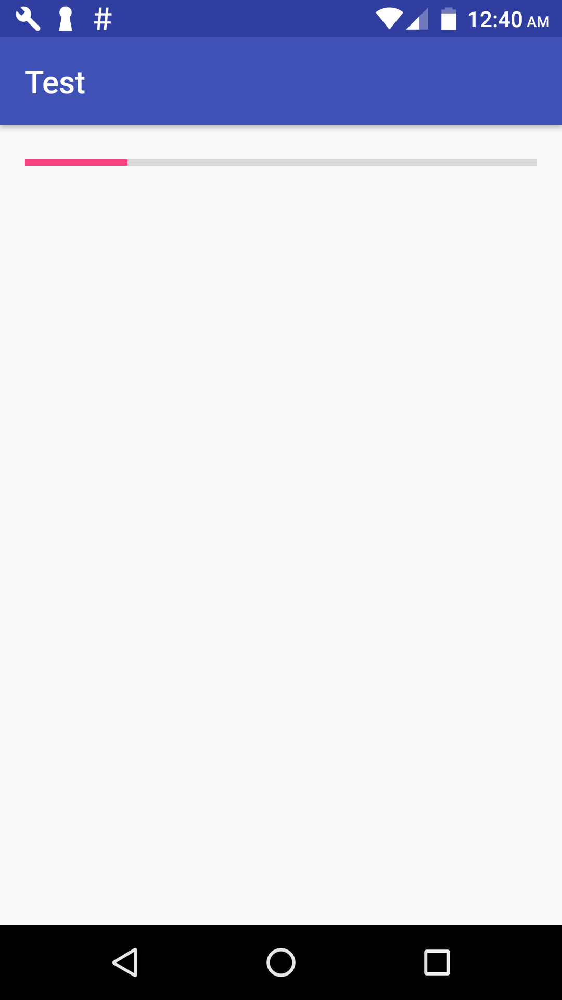

This is Glide tutorial for Android to load images from url and show progress count while Glide loading big images. Loading images with Glide are easy and best solution, because Glide store images in cache same as Picasso library. Using Glide library is better than own implementation and show images on ImageView. And you are reading this tutorial because you know about Glide and how to use Glide to load Images efficiently on Android from URL.

ok so lets focus on our main topic about how to display progress count while Glide is Loading big images. As you know Glide doesn't provide any Interface which will notify Progress count. So we have to use OkHttp with Glide, so that we can get Download progress count.

## <span style="color: #ff6600;">Show Progress Count while loading big images using Glide :</span>

for this we can use OkHttp Library and OkHttp Integration for Glide.

### <span style="color: #339966;">so add below libraries to your project.</span>

<pre style="color: #000000;">compile <span style="font-weight: bold; color: #008000;">'com.github.bumptech.glide:glide:3.7.0'</span>
compile <span style="font-weight: bold; color: #008000;">'com.squareup.okhttp:okhttp:2.7.5'</span>
compile <span style="font-weight: bold; color: #008000;">'com.github.bumptech.glide:okhttp-integration:1.4.0'</span>
</pre>


Now we need to create an Interface which will give progress count from OkHttp to our activity.

### <span style="color: #339966;">below is whole code of my activity:</span>

```java
package com.edablogs.test;

import android.os.Bundle;
import android.support.v7.app.AppCompatActivity;
import android.util.Log;
import android.widget.ImageView;
import android.widget.ProgressBar;

import com.bumptech.glide.Glide;
import com.bumptech.glide.integration.okhttp.OkHttpUrlLoader;
import com.bumptech.glide.load.engine.DiskCacheStrategy;
import com.bumptech.glide.load.model.GlideUrl;
import com.squareup.okhttp.Interceptor;
import com.squareup.okhttp.MediaType;
import com.squareup.okhttp.OkHttpClient;
import com.squareup.okhttp.Response;
import com.squareup.okhttp.ResponseBody;

import java.io.IOException;
import java.io.InputStream;

import okio.Buffer;
import okio.BufferedSource;
import okio.ForwardingSource;
import okio.Okio;
import okio.Source;

public class GifActivity extends AppCompatActivity {
    private ImageView img;
    private OkHttpClient mOkHttpClient;
    private final static String DOWNLOAD_URL = "https://learnpainless.com/demo.jpg";
    @Override
    protected void onCreate(Bundle savedInstanceState) {
        super.onCreate(savedInstanceState);
        setContentView(R.layout.activity_gif);
        img = (ImageView) findViewById(R.id.image_view);

        Glide.with(this).load(DOWNLOAD_URL).into(img);

        final ProgressBar progressBar = (ProgressBar) findViewById(R.id.progress);

        mOkHttpClient = new OkHttpClient();

        final ProgressListener progressListener = new ProgressListener() {
            @Override
            public void update(long bytesRead, long contentLength, boolean done) {
                int progress = (int) ((100 * bytesRead) / contentLength);

                // Enable if you want to see the progress with logcat
                // Log.v(LOG_TAG, "Progress: " + progress + "%");
                progressBar.setProgress(progress);
                if (done) {
                    Log.i("GifActivity", "Done loading");
                }
            }
        };

        mOkHttpClient.networkInterceptors().add(new Interceptor() {
            @Override
            public Response intercept(Chain chain) throws IOException {
                Response originalResponse = chain.proceed(chain.request());
                return originalResponse.newBuilder()
                        .body(new ProgressResponseBody(originalResponse.body(), progressListener))
                        .build();
            }
        });

        Glide.get(this)
                .register(GlideUrl.class, InputStream.class, new OkHttpUrlLoader.Factory(mOkHttpClient));
        Glide.with(this)
                .load(DOWNLOAD_URL)
                // Disabling cache to see download progress with every app load
                // You may want to enable caching again in production
                .diskCacheStrategy(DiskCacheStrategy.NONE)
                .into(img);
    }

    private static class ProgressResponseBody extends ResponseBody {

        private final ResponseBody responseBody;
        private final ProgressListener progressListener;
        private BufferedSource bufferedSource;

        public ProgressResponseBody(ResponseBody responseBody, ProgressListener progressListener) {
            this.responseBody = responseBody;
            this.progressListener = progressListener;
        }

        @Override
        public MediaType contentType() {
            return responseBody.contentType();
        }

        @Override
        public long contentLength() throws IOException {
            return responseBody.contentLength();
        }

        @Override
        public BufferedSource source() throws IOException {
            if (bufferedSource == null) {
                bufferedSource = Okio.buffer(source(responseBody.source()));
            }
            return bufferedSource;
        }

        private Source source(Source source) {
            return new ForwardingSource(source) {
                long totalBytesRead = 0L;

                @Override
                public long read(Buffer sink, long byteCount) throws IOException {
                    long bytesRead = super.read(sink, byteCount);
                    // read() returns the number of bytes read, or -1 if this source is exhausted.
                    totalBytesRead += bytesRead != -1 ? bytesRead : 0;
                    progressListener.update(totalBytesRead, responseBody.contentLength(), bytesRead == -1);
                    return bytesRead;
                }
            };
        }
    }

    interface ProgressListener {
        void update(long bytesRead, long contentLength, boolean done);
    }
}

```

and below is code of my xml file.

```xml
<?xml version="1.0" encoding="utf-8"?>
<RelativeLayout xmlns:android="http://schemas.android.com/apk/res/android"
    xmlns:tools="http://schemas.android.com/tools"
    android:id="@+id/activity_gif"
    android:layout_width="match_parent"
    android:layout_height="match_parent"
    android:paddingBottom="@dimen/activity_vertical_margin"
    android:paddingLeft="@dimen/activity_horizontal_margin"
    android:paddingRight="@dimen/activity_horizontal_margin"
    android:paddingTop="@dimen/activity_vertical_margin"
    tools:context="com.edablogs.test.GifActivity">
    <ImageView
        android:layout_width="match_parent"
        android:id="@+id/image_view"
        android:layout_centerInParent="true"
        android:layout_height="match_parent" />
    <ProgressBar
        android:layout_width="match_parent"
        style="@style/Widget.AppCompat.ProgressBar.Horizontal"
        android:id="@+id/progress"
        android:layout_height="wrap_content" />
</RelativeLayout>

```

## screenshot

[](img/progress_count_glide_android.png)
