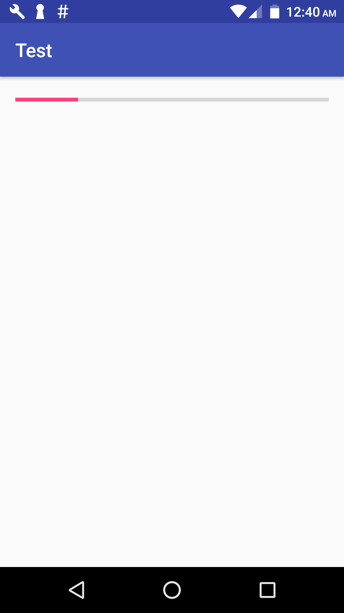

import Gist from 'react-gist'

This is Glide tutorial for Android to load images from url and show progress count while Glide loading big images. Loading images with Glide are easy and best solution, because Glide store images in cache same as Picasso library. Using Glide library is better than own implementation and show images on ImageView. And you are reading this tutorial because you know about Glide and how to use Glide to load Images efficiently on Android from URL.

ok so lets focus on our main topic about how to display progress count while Glide is Loading big images. As you know Glide doesn't provide any Interface which will notify Progress count. So we have to use OkHttp with Glide, so that we can get Download progress count.

## Show Progress Count while loading big images using Glide :

for this we can use OkHttp Library and OkHttp Integration for Glide.

### so add below libraries to your project.

<Gist id='1e13e7b206e72717f8d2f1d2318412c8' file='build.gradle' />

Now we need to create an Interface which will give progress count from OkHttp to our activity.

### below is whole code of my activity:

<Gist id='1e13e7b206e72717f8d2f1d2318412c8' file='GifActivity.java' />

and below is code of my xml file.

<Gist id='1e13e7b206e72717f8d2f1d2318412c8' file='activity_gif.xml' />

## screenshot

