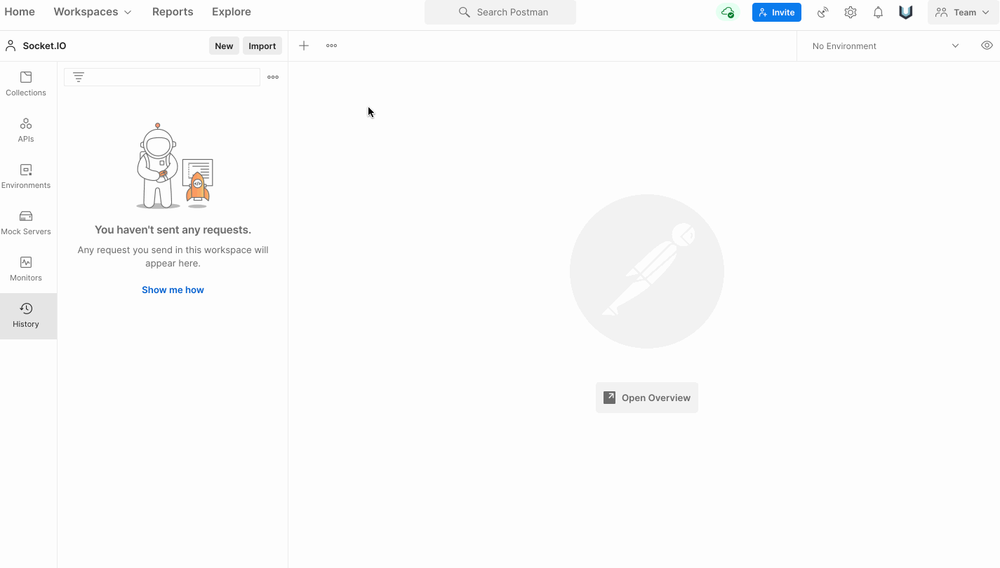
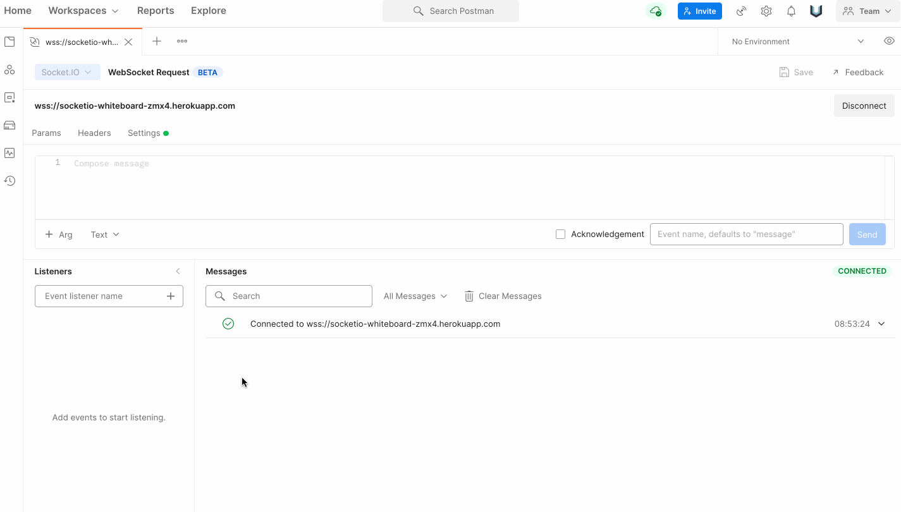
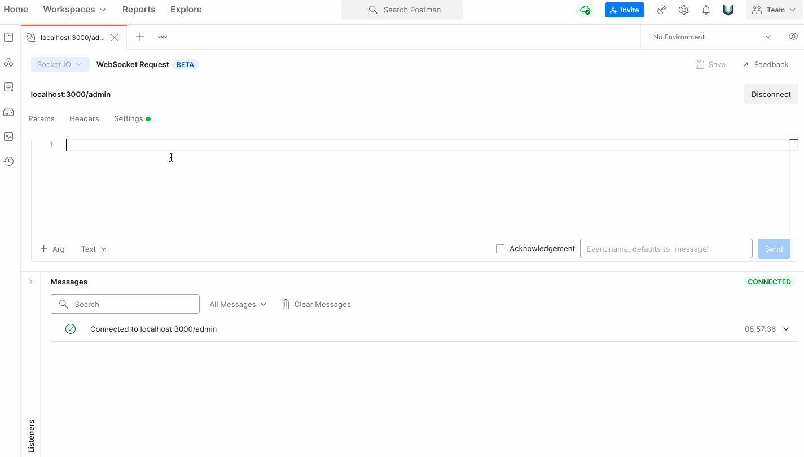

## How to test your socket.io backend without developing frontend?

Have you ever thought of using Postman to test your **socket.io** server? The latest version of Postman supports **socket.io** testing with some limitations which are listed below. In addition, I have also shown an example of how message passing **socket.io** works between server and postman (client).

**Socket.IO** is one of the most popular libraries that enables real-time, bidirectional and event-based communication between a web client and a server, using WebSockets under the hood. With many developers using **Socket.IO** in conjunction with the HTTP API, you can now enjoy the benefits of Postman when switching between these two paradigms. This represents a major step forward for Postman in our goal of providing exceptional tooling and support for the **WebSockets** community.

Instead of writing code over and over to debug your **Socket.IO** API, you can now simply open Postman, connect to your server, and interactively debug the API in real time. And you will no longer be blind, because you will now have tons of tools and diagnostics at your fingertips.

## Getting started

If you have used **raw WebSockets** in **Postman** before, you will already be familiar with the user interface of **Socket.IO**. Here's how you can establish a connection with your Socket.IO server in Postman—with just a few steps:

1. Click on **New** from left sidebar.
2. Now choose **Websocket** Request
3. click on dropdown which says **"Raw"** and select **Socket.io** instead.
4. Now hit connect button.

## Listening to events

Now that you are connected to your server, you need to listen for specific events. To do this, type the name of an event in the Listener panel, and click the "+" to add it. Since this is Socket.IO, you will only receive events for which you have added listeners. You can quickly disable and re-enable listeners with a single click, making it easy and flexible to listen to different combinations of events that interest you.

When you send or receive an event, it will appear in the unified event timeline, showing you the entire history of the connection in one place. The timeline shows a preview of each event, giving you an overview of the information, but you can dive into the full content of an event by simply clicking to expand it.

**Pro tip**: _Socket.IO_ events can have multiple arguments, so we've provided an argument selector to toggle between them (if there is more than one).

## Send events

Like **raw WebSockets**, **Socket.IO** is bidirectional, which means you can send messages to the server whenever you want. You can write (or paste) your messages into the message editor to fire event, type an event name, and click Send. Also, you can attach additional logic to your event by clicking **"+Arg"**.

Postman supports various input formats like _JSON_, _text_, _binary_ and more, which you can toggle as you wish. In fact, each argument may use a different input format. Keep your eyes open for even more input formats in the future.