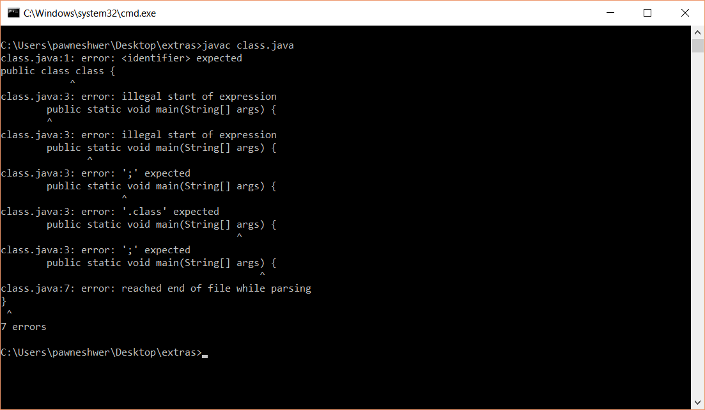

## Keywords

Keywords are some special names which are reserved by JAVA, We can not use that names to create variables,classes or methods. They have their different meanings. for example "**class**", its reserved by JAVA. This keyword is used to create new class but if we try to use that name for our class then its impossible.

for example if we make a class like this example :

```java

class class{
  public static void main(String[] args){
    System.out.println("Hello");
  }
}
```

and when you try to run this code then you will get below error :

```
_class.java:1: error: <identifier> expected_

```

as shown in below screenshot.

[](img/java-keyword.png)

## List of Keywords in JAVA :

1.	abstract
2.	assert
3.	boolean
4.	break
5.	byte
6.	case
7.	catch
8.	char
9.	class
10.	const
11.	continue
12.	default
13.	do
14.	double
15.	else
16.	enum
17.	extends
18.	final
19.	finally
20.	float
21.	for
22.	goto
23.	if
24.	implements
25.	import
26.	instanceof
27.	int
28.	interface
29.	long
30.	native
31.	new
32.	package
33.	private
34.	protected
35.	public
36.	return
37.	short
38.	static
39.	strictfp
40.	super
41.	switch
42.	synchronized
43.	this
44.	throw
45.	throws
46.	transient
47.	try
48.	void
49.	volatile
50.	while

**here is list by categories :**

<table style="height: 368px;" border="1" width="676" cellspacing="0" cellpadding="0">
<tbody>
<tr>
<td valign="top" width="145">Category</td>
<td valign="top" width="516">Keywords</td>
</tr>
<tr>
<td valign="top" width="145"><em>Access modifiers</em></td>
<td valign="top" width="516"><strong>private</strong><em>, </em><strong>protected</strong>,<strong> public</strong></td>
</tr>
<tr>
<td valign="top" width="145"><em>Class, method, variable modifiers</em></td>
<td valign="top" width="516"><strong>abstract</strong><em>, </em><strong>class</strong><em><b>, </b></em><strong>extends</strong><em><b>, </b></em><strong>final</strong><em><b>, </b></em><strong>implements</strong><em><b>, </b></em><strong>interface</strong><em><b>, </b></em><strong>native</strong><em><b>, </b></em><strong>new</strong><em><b>,</b></em><strong>static</strong><em><b>, </b></em><strong>strictfp</strong><em><b>, </b></em><strong>synchronized</strong><em><b>, </b></em><strong>transient</strong><em><b>, </b></em><strong>volatile</strong></td>
</tr>
<tr>
<td valign="top" width="145"><em>Flow control</em></td>
<td valign="top" width="516"><strong>break, case, continue, default, do, else, for, if, instanceof, return,switch, while</strong></td>
</tr>
<tr>
<td valign="top" width="145"><em>Package control</em></td>
<td valign="top" width="516"><strong>import, package</strong></td>
</tr>
<tr>
<td valign="top" width="145"><em>Primitive types</em></td>
<td valign="top" width="516"><strong>boolean, byte, char, double, float, int, long, short</strong></td>
</tr>
<tr>
<td valign="top" width="145"><em>Error handling</em></td>
<td valign="top" width="516"><strong>assert, catch, finally, throw, throws, try</strong></td>
</tr>
<tr>
<td valign="top" width="145"><em>Enumeration</em></td>
<td valign="top" width="516"><strong>enum</strong></td>
</tr>
<tr>
<td valign="top" width="145"><em>Others</em></td>
<td valign="top" width="516"><strong>super, this, void</strong></td>
</tr>
<tr>
<td valign="top" width="145"><em>Unused</em></td>
<td valign="top" width="516"><strong>const, goto</strong></td>
</tr>
</tbody>
</table>

These are **keywords** in java, each and every **keyword** have its special task. for example '**class**' **keyword** is used to create Classes in java. It is impossible to create Class without using '**class**' keyword.

