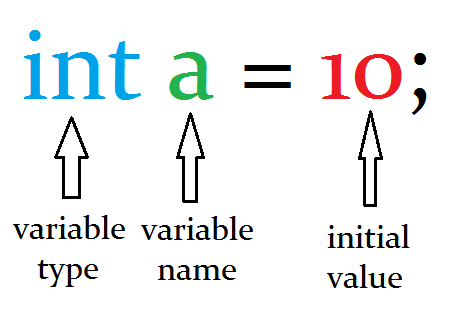

Hello Readers !!!

## <span style="color: #ff6600;">What is variable ???</span>

This is mostly asked questions when you enter in any Programming field (JAVA,PHP,Android,C++,C# etc.). And the definition is same for all programming languages.
In simple words variables are container which are used to store some values. value should be anything.

for example

``` java
  int a = 10;
```
in given example **a** is a variable and we are storing **10** into variable **a**. and we make that variable as _int_ becase **10** is of **int** type data. in **int** type data we can't store _a,b,c_. To store _a,b,c_ we need to change type of variable **a** to _char_ or _String_. because _a,b,c_ are alphabet. so we will store like this :

``` java
  char a = 'a';
  char demo = 'b';
  String test = "abc";
```

To store single character we use _char_ and it should be written inside single quotes (''), and to store a word or sentence we need to use _String_ as data type and it should be written inside double quotes ("").

Type of variable depend on which type of data we are going to store in it.

## <span style="color: #ff6600;">Variables are of two types:</span>

1.  Primitive Data type
2.  Complex objects

### <span style="color: #008080;">Primitive type :</span>

Primitive objects are normal variables like int, char, float etc. We can arrange them in list like below

*   Single character (A,B,C,1)
*   Boolean (true/false)
*   Numerical values (float, int, double etc.)

### <span style="color: #008080;">Complex variables :</span>

Complex variables are those variables which is made from Class. It should be built in class or custom class. If any variables are made from class is count under complex variables.

*   String
*   Date
*   Integer

These are variables of classes so its count under complex variables.

## <span style="color: #ff6600;">How to declare variables</span>

### <span style="color: #339966;">Primitive variables are declared in 3 parts :</span>

*   Data type of variable (<span style="color: #ff0000;">***Required**</span>)
*   Name of variable (<span style="color: #ff0000;">***Required**</span>)
*   Initial Value of variable (<span style="color: #339966;">**optional**</span>)

for example as shown in below image : [](img/variable.png)

### <span style="color: #339966;">Complex variables are declared as below:</span>

*   Complex variables are Instance of Class.
*   Complex variables use new keyword and Constructor of that class.
*   It contains value of class, because its Instance of that class.

for example :

```java
MyClass test = new MyClass();
```

## <span style="color: #ff6600;">Declaration type of variables:</span>

1.  Local Variables
2.  Global Variables (it’s also known as Instance variables)

### <span style="color: #339966;">Local Variable :</span>

Local Variables are declared and initialize inside Method, and their scope is only inside that class.

For example

```java
class First{
  public static void main(String[] args){
    int num = 10;
    }
  }
```

### <span style="color: #339966;">Global Variables:</span>

Global Variables are declared outside the methods but inside class. It is also called as Instance variables. Global Variables are accessible from every methods and inner classes of that class. It is also available for derived class if Global Variables are declared as public.

for example

```java
class First{
  int num = 10;
  public static void main(String[] args){
     System.out.println(num);
    }
  }
```

