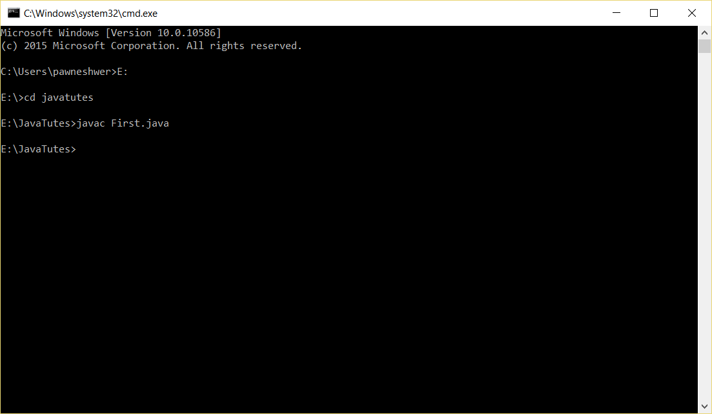
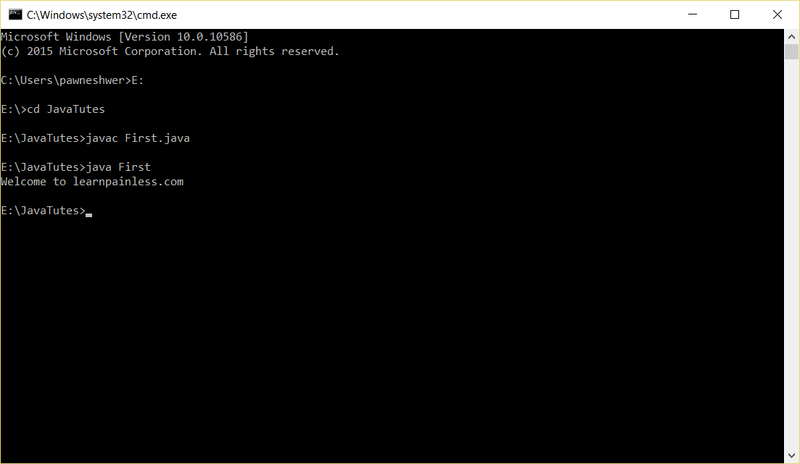

To get started first of all create new [folder](http://en.wikipedia.org/wiki/Folder_%28computing%29 "Folder (computing)") where you will save your exercise files and which is easily accessible. In my system I am going to create folder <span style="color: #ff6600;">_JavaTutes_</span> in <span style="color: #ff6600;">E:</span> drive. Keep in mind that there is no space in folder name. Path of my folder is **<span style="color: #ff6600;">E:/JavaTutes</span>**.

## <span style="color: #339966;">Ok so let’s start.</span>

1.  Open **[Notepad](http://en.wikipedia.org/wiki/Notepad_%28software%29 "Notepad (software)")** and save this as <span style="color: #ff6600;">**First.java**</span> (_to save on top menu bar click on [File](http://en.wikipedia.org/wiki/Computer_file "Computer file") -> [Save as](http://en.wikipedia.org/wiki/Computer_file_management "Computer file management")..., In Save as type choose all files and in name type "<span style="color: #ff6600;">First.java</span>"_). And click on save button.
2.  Now start typing in notepad (<span style="color: #ff6600;">**First.java file**</span>).
3.  First of all, create class, as in previous tutorial I said that file should match with class name. And the class name will be First.
4.  Inside class we need to define main method, because main method executive very first and without main method your program will not execute.
5.  Inside main method you can do anything what you want.
6.  So for now we will only print "**<span style="color: #ff6600;">Welcome to learnpainless.com</span>**".
7.  To print anything on screen we use <span style="color: #ff6600;">**System.out()**</span>. Our message will be inside brackets of **<span style="color: #ff6600;">out().</span>** As shown below.
8.  Now save your file, and open [Command Prompt](http://en.wikipedia.org/wiki/Command_Prompt "Command Prompt"). To open Command Prompt open start in Windows and search cmd.
9.  Command Prompt will start with <span style="color: #ff6600;">**c:/windows/system32**</span> etc. folder. So we need to first go inside our project files folder from command prompt.
10.  Use **<span style="color: #ff6600;">cd</span>** command to [change directory](http://en.wikipedia.org/wiki/Cd_%28command%29 "Cd (command)"). And [Drive letter](http://en.wikipedia.org/wiki/Drive_letter_assignment "Drive letter assignment") to change drive. For example, my files are inside E drive so first I will change drive by typing <span style="color: #ff6600;">**E:**</span> and hit enter.
11.  Now type <span style="color: #ff6600;">**cd JavaTutes**</span> and hit <span style="color: #ff6600;">enter</span>.
12.  Now I am inside my project files folder. So I will compile my [java class](http://en.wikipedia.org/wiki/Java_class_file "Java class file"). Type this command o compile java file. javac [Filename](http://en.wikipedia.org/wiki/Filename "Filename") for example “**<span style="color: #ff6600;">javac First.java</span>**” and hit enter

[](img/java-first-program-1.png)

13.  If there is no error in file, then command prompt will show your project directory without any message.
14.  If you go inside your project folder from My Computer, then you will see 2 files there <span style="color: #ff6600;">**First.java**</span> and <span style="color: #ff6600;">**First.class**</span> file. And if you open that First.class file with notepad then you will see encrypted codes. Because its compiles file of our file. In <span style="color: #ff6600;">**[Bytecode](http://en.wikipedia.org/wiki/Java_bytecode "Java bytecode")**</span>.
15.  To execute this **<span style="color: #ff6600;">bytecode</span>** file in command prompt type java Filename for example java First and hit enter. And you will see your output in command prompt. As my output is "<span style="color: #ff6600;">_Welcome to learnpainless.com_</span>".

[](img/java-first-program-2.png)

here is example code of First.java file  

```java
class First{
	public static void main(String[] args){
		System.out.println("Welcome to learnpainless.com");
	}
}
```

This is how we write java programs and how we execute java programs. And you also seen that what **Bytecode** file we are talking about in introduction posts. And if we run that First.class file on another OS them it will execute without any exception, that's why java is platform independent and secure.

